# Melosys E2E Tests

End-to-end tests for Melosys using Playwright and TypeScript. Record workflows, automate regression testing, and debug without manual clicking.

## Quick Start

```bash
# 1. Start services (required)
cd ../melosys-docker-compose && make start-all

# 2. Install dependencies
npm install
npx playwright install

# 3. Run tests
npm test

# 4. Interactive mode (recommended for development)
npm run test:ui
```

## Architecture


## Docker Services Overview

All 17 services required for E2E tests:


## Test Flow

```mermaid
sequenceDiagram
    participant Dev as 👨‍💻 Developer
    participant PW as 🎭 Playwright
    participant App as 🌐 Melosys App
    participant API as ⚙️ API
    participant DB as 💾 Oracle DB

    Note over Dev,DB: Recording Phase
    Dev->>PW: npm run codegen
    PW->>App: Opens browser
    Dev->>App: Perform workflow
    App->>API: API calls
    API->>DB: Save data
    App->>App: Record actions
    PW->>Dev: Generate test code

    Note over Dev: Copy code to test file

    Note over Dev,DB: Execution Phase
    Dev->>PW: npm test
    PW->>App: Execute recorded actions
    App->>API: API calls
    API->>DB: Save data
    API-->>App: Response
    App-->>PW: Response
    PW->>DB: Verify data (optional)
    DB-->>PW: Query result
    PW->>Dev: Test result + trace + video
```



## Project Structure

```mermaid
graph LR
    Root["📁 melosys-e2e-tests/"]

    Root --> Tests["📂 tests/"]
    Root --> Helpers["📂 helpers/"]
    Root --> Config["⚙️ playwright.config.ts"]
    Root --> GHA["📂 .github/workflows/"]
    Root --> Docker["🐳 docker-compose.yml"]

    Tests --> T1["example-workflow.spec.ts"]
    Tests --> T2["form-helper-example.spec.ts"]
    Tests --> T3["workflow-parts.spec.ts"]
    Tests --> T4["workflow-rune-tester.spec.ts"]

    Helpers --> H1["auth-helper.ts"]
    Helpers --> H2["form-helper.ts"]
    Helpers --> H3["db-helper.ts"]
    Helpers --> H4["auth-state-helper.ts"]

    GHA --> E2E["e2e-tests.yml"]

    style Root fill:#5B9BD5,stroke:#2E5C8A,color:#fff
    style Tests fill:#66BB6A,stroke:#388E3C,color:#fff
    style Helpers fill:#FF9800,stroke:#C77700,color:#000
    style Config fill:#AB47BC,stroke:#6A2C70,color:#fff
    style GHA fill:#26A69A,stroke:#1A7A6E,color:#fff
    style Docker fill:#F4A460,stroke:#C97F3E,color:#000

    style T1 fill:#82B366,stroke:#4A7C3B,color:#fff
    style T2 fill:#82B366,stroke:#4A7C3B,color:#fff
    style T3 fill:#82B366,stroke:#4A7C3B,color:#fff
    style T4 fill:#82B366,stroke:#4A7C3B,color:#fff

    style H1 fill:#FFB74D,stroke:#C77700,color:#000
    style H2 fill:#FFB74D,stroke:#C77700,color:#000
    style H3 fill:#FFB74D,stroke:#C77700,color:#000
    style H4 fill:#FFB74D,stroke:#C77700,color:#000

    style E2E fill:#4DB6AC,stroke:#1A7A6E,color:#fff
```



## Essential Commands

### Recording Workflows

```bash
# Record new workflow with code generation
npm run codegen

# Run test with trace for debugging
npx playwright test --trace on
```

### Running Tests

```bash
# All tests
npm test

# Specific test file
npm test tests/example-workflow.spec.ts

# Specific test by name
npx playwright test --grep "workflow name"

# With visible browser
npm run test:headed

# Debug mode (step through)
npm run test:debug

# Interactive UI (best for development)
npm run test:ui
```

### Viewing Results

```bash
# HTML report
npm run show-report

# Trace viewer (most detailed)
npm run show-trace

# Videos
npm run open-videos

# Screenshots
npm run open-screenshots

# Clean results
npm run clean-results
```

## Helper Classes

### FormHelper - Handle Dynamic Forms

```typescript
import { FormHelper } from '../helpers/form-helper';

const formHelper = new FormHelper(page);

// Fill field that triggers API call
await formHelper.fillAndWaitForApi(
  page.getByRole('textbox', { name: 'Bruttoinntekt' }),
  '100000',
  '/trygdeavgift/beregning'
);

// Wait for network to be idle (most reliable)
await formHelper.fillAndWaitForNetworkIdle(
  page.getByRole('textbox', { name: 'Field' }),
  'value'
);

// Conditional radio button
await formHelper.checkRadioIfNeeded(
  page.getByRole('radio', { name: 'Option' })
);
```

### AuthHelper - Handle Authentication

```typescript
import { AuthHelper } from '../helpers/auth-helper';

const auth = new AuthHelper(page);
await auth.login();
```

### DatabaseHelper - Verify Data

```typescript
import { withDatabase } from '../helpers/db-helper';

await withDatabase(async (db) => {
  const result = await db.queryOne(
    'SELECT * FROM BEHANDLING WHERE id = :id',
    { id: 123 }
  );
  expect(result).not.toBeNull();
});
```

## Test Template

```typescript
import { test, expect } from '@playwright/test';
import { AuthHelper } from '../helpers/auth-helper';
import { FormHelper } from '../helpers/form-helper';
import { withDatabase } from '../helpers/db-helper';

test.describe('Workflow Name', () => {
  test('should complete workflow', async ({ page }) => {
    // Setup
    const auth = new AuthHelper(page);
    await auth.login();
    const formHelper = new FormHelper(page);

    // Navigate
    await page.goto('http://localhost:3000/melosys/');

    // Perform workflow steps (from codegen)
    await formHelper.fillAndWaitForApi(
      page.getByRole('textbox', { name: 'Field' }),
      'value',
      '/api/endpoint'
    );

    // Verify UI
    await expect(page.locator('text=Success')).toBeVisible();

    // Verify database (optional)
    await withDatabase(async (db) => {
      const result = await db.queryOne(
        'SELECT * FROM TABLE WHERE id = :id',
        { id: 123 }
      );
      expect(result).not.toBeNull();
    });
  });
});
```

## Configuration

### Environment Variables

Create `.env` file (use `.env.example` as template):

```bash
# Database (defaults work for Mac ARM)
DB_USER=MELOSYS
DB_PASSWORD=melosys
DB_CONNECT_STRING=localhost:1521/freepdb1  # Mac ARM
# DB_CONNECT_STRING=localhost:1521/XEPDB1  # Intel/CI

# Base URL (optional)
BASE_URL=http://localhost:3000
```

### Key Settings (playwright.config.ts)

- **Base URL**: `http://localhost:3000`
- **Trace**: Always on (`trace: 'on'`)
- **Video**: Always recorded (`video: 'on'`)
- **Screenshots**: Always captured (`screenshot: 'on'`)
- **Slow motion**: 100ms delay (`slowMo: 100`)
- **Workers**: 1 on CI, unlimited locally
- **Parallel**: Disabled (`fullyParallel: false`)

## CI/CD - GitHub Actions

Workflow at `.github/workflows/e2e-tests.yml`:

```mermaid
graph TD
    A[🚀 Trigger: workflow_dispatch] --> B[📥 Checkout Code]
    B --> C[⚙️ Setup Node.js 20]
    C --> D[📦 Install npm dependencies]
    D --> E[🎭 Install Playwright browsers]
    E --> F[🔐 Login to NAIS registry]
    F --> G[🌐 Create Docker network]
    G --> H[🐳 Start Docker Compose services]
    H --> I{✅ Services healthy?}
    I -->|Yes| J[🧪 Run Playwright tests]
    I -->|No| K[⏳ Wait & Retry]
    K --> I
    J --> L{✅ Tests pass?}
    L -->|Yes| M[📊 Upload test results]
    L -->|No| M
    M --> N[📄 Upload Playwright report]
    N --> O[💬 Publish PR comment]

    style A fill:#5B9BD5,stroke:#2E5C8A,color:#fff
    style B fill:#82B366,stroke:#4A7C3B,color:#fff
    style C fill:#82B366,stroke:#4A7C3B,color:#fff
    style D fill:#82B366,stroke:#4A7C3B,color:#fff
    style E fill:#82B366,stroke:#4A7C3B,color:#fff
    style F fill:#82B366,stroke:#4A7C3B,color:#fff
    style G fill:#82B366,stroke:#4A7C3B,color:#fff
    style H fill:#FF9800,stroke:#C77700,color:#000
    style I fill:#F4A460,stroke:#C97F3E,color:#000
    style J fill:#66BB6A,stroke:#388E3C,color:#fff
    style K fill:#EF5350,stroke:#C62828,color:#fff
    style L fill:#F4A460,stroke:#C97F3E,color:#000
    style M fill:#9575CD,stroke:#5E3A99,color:#fff
    style N fill:#9575CD,stroke:#5E3A99,color:#fff
    style O fill:#AB47BC,stroke:#6A2C70,color:#fff
```



## Troubleshooting

### Tests timeout
```typescript
// Increase timeout in playwright.config.ts
use: {
  actionTimeout: 30000,
}
```

### Services not available
```bash
# Verify services are running
cd ../melosys-docker-compose
docker ps
curl http://localhost:3000/melosys/
```

### Database connection fails
```bash
# Check Oracle logs
docker logs melosys-oracle

# Verify credentials in .env
cat .env
```

### Recorded test breaks after UI changes
```bash
# Re-record with codegen
npm run codegen

# Or ask frontend for stable data-testid attributes
```

## Tips

1. **Always use FormHelper** for fields that trigger API calls
2. **Use test:ui mode** for development - best debugging experience
3. **Check traces first** when tests fail - most comprehensive info
4. **Use meaningful test names** - `oppgave-to-vedtak.spec.ts` not `test1.spec.ts`
5. **Add database verification** - ensures data is actually persisted

## Resources

- [Playwright Documentation](https://playwright.dev)
- [Playwright Best Practices](https://playwright.dev/docs/best-practices)
- [Trace Viewer Guide](https://playwright.dev/docs/trace-viewer)
- [HELPERS-GUIDE.md](reports/HELPERS-GUIDE.md) - Detailed helper usage

---

**Happy Testing! 🎭**
