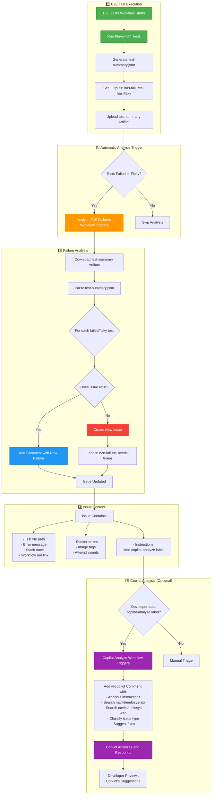

# E2E Failure Analysis Workflow Diagram

## Flow Description

### 1. E2E Test Execution
- Tests run via GitHub Actions
- Playwright generates `test-summary.json` with results
- Workflow sets outputs and uploads artifact

### 2. Automatic Analysis Trigger
- Workflow completion triggers analysis workflow
- Only proceeds if there are failures or flaky tests

### 3. Failure Analysis
- Downloads test results from artifact
- Processes each failed/flaky test
- Creates or updates GitHub issues
- Applies labels for categorization

### 4. Issue Content
- Comprehensive failure information
- Links to workflow run for debugging
- Docker log errors for context
- Image tags for reproducibility
- Instructions for next steps

### 5. Copilot Analysis (Optional)
- Developer adds `copilot-analyze` label
- Workflow triggers Copilot analysis
- Copilot searches relevant repositories
- Provides classification and recommendations
- Developer applies suggested fixes

## Key Features

✅ **Automatic Detection** - No manual issue creation needed
✅ **Deduplication** - Updates existing issues instead of creating duplicates
✅ **Rich Context** - Includes errors, logs, and environment details
✅ **AI Analysis** - Copilot helps classify and suggest fixes
✅ **Manual Trigger** - Can re-analyze any workflow run
