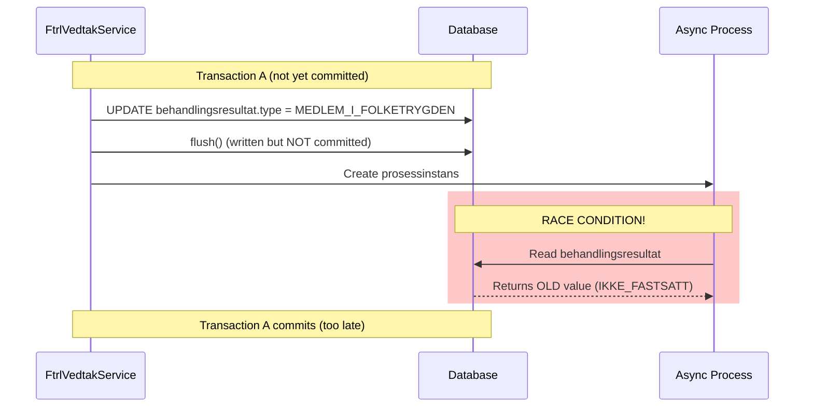
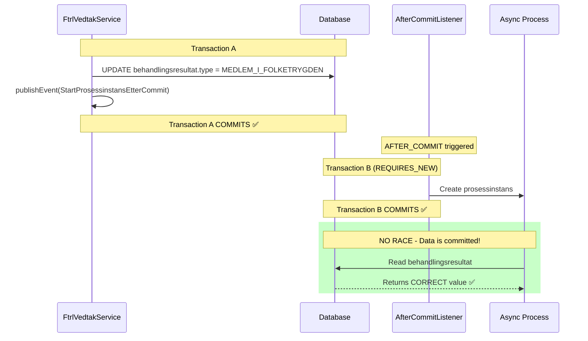
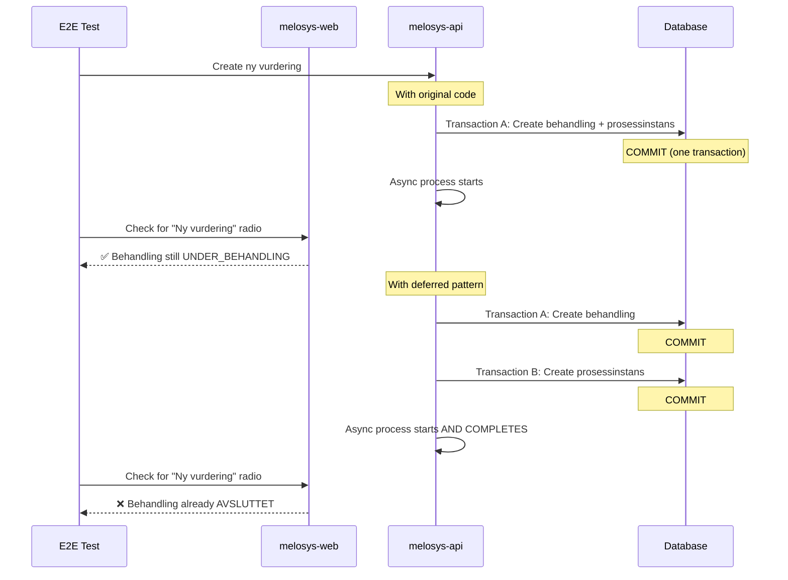
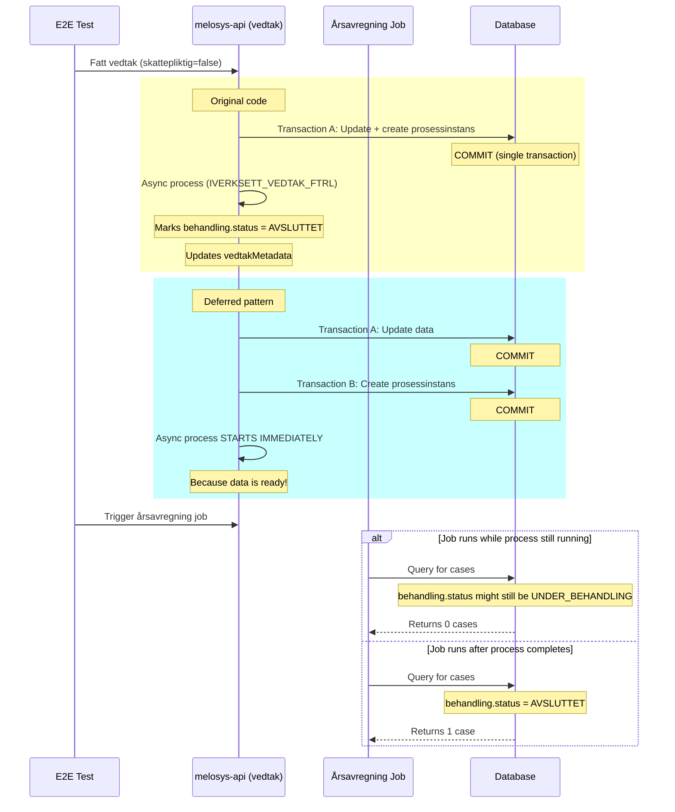

# Deferred Prosessinstans Pattern - Unintended Side Effect

**Date:** 2025-11-25
**Status:** Analysis Complete
**Issue:** Deferred pattern fixes race condition but creates timing issue

---

## TL;DR - The Paradox

The deferred prosessinstans pattern **successfully fixes the race condition** where async processes read stale database data. However, it introduces a **new timing problem** in certain workflows where processes complete **too fast**, causing the frontend to miss intermediate states.

**Before (original code):**
- ❌ Race condition: Async process reads stale data (10% failure rate)
- ✅ Frontend sees behandling in intermediate state

**After (deferred pattern):**
- ✅ No race condition: Data always committed before async process
- ❌ Process completes so fast that frontend misses intermediate state

---

## The Original Problem (RACE-CONDITION-REPORT.md)

### What Was Happening


**Result:** Årsavregning job found 0 cases instead of 1 (10% of time in CI)

### The Fix (Deferred Pattern)


**Result:** Race condition solved! Data is always correct.

---

## The New Problem (Nyvurdering Workflow)

### What's Failing Now

**Test:** `nyvurdering-endring-skattestatus.spec.ts`
**Error:** `TimeoutError: waiting for getByRole('radio', { name: 'Ny vurdering' })`
**Frequency:** 100% failure in CI with deferred pattern, 0% failure locally

### Why It Happens

The deferred pattern adds **two transaction boundaries** instead of one:

```
Original:
├─ Transaction A (fattVedtak + opprettProsessinstans)
└─ Async process starts (AFTER_COMMIT)

Deferred:
├─ Transaction A (fattVedtak only)
│  └─ COMMIT ✅
├─ Transaction B (opprettProsessinstans)
│  └─ COMMIT ✅
└─ Async process starts (AFTER_COMMIT)
```

**In CI environment** (slower, shared resources):
1. Test calls `opprettNyVurdering()` which creates prosessinstans
2. With deferred pattern, this happens in Transaction B
3. Transaction B commits
4. Async process starts and **completes INSTANTLY** (because data is ready)
5. By the time the frontend checks (milliseconds later), behandling is already `AVSLUTTET`
6. Frontend doesn't show "Ny vurdering" radio button (only shown for active behandlinger)
7. Test timeout waiting for element that will never appear

**Locally** (fast CPU):
- Everything happens so fast it doesn't matter
- Or network latency gives enough buffer time
- Tests pass 100%

### The Specific Workflow Affected



---

## Evidence from CI Logs

### Successful Deferred Pattern Execution

From `melosys-api-complete.log`:

```
20:29:25.334 | FtrlVedtakService | Fatter vedtak for (FTRL) sak: MEL-10 behandling: 10
20:29:25.376 | ProsessinstansService | opprettet prosessinstans ...OPPRETT_OG_DISTRIBUER_BREV
20:29:25.403 | StartProsessinstansEtterCommitListener | Oppretter prosessinstans IVERKSETT_VEDTAK_FTRL for behandling 10 etter commit
20:29:25.404 | ProsessinstansService | opprettet prosessinstans ...IVERKSETT_VEDTAK_FTRL
```

✅ The deferred pattern IS working - listener creates prosessinstans after commit

### But Process Completes Too Fast

```
20:29:25.729 | E2ESupportController | Starting wait for prosessinstanser (timeout: 30s)
20:29:25.934 | E2ESupportController | All prosessinstanser completed successfully in 0s
```

⚠️ Process completed in **0 seconds** (actually ~200ms based on timestamps)

### Test Failure Point

From test logs:
```
📝 Step 11: Creating ny vurdering...
📝 Step 12: Wait for behandling creation...
📝 Step 13: Opening active behandling BEFORE it completes...
❌ TimeoutError: locator.check: Timeout 10000ms exceeded.
     - waiting for getByRole('radio', { name: 'Ny vurdering' })
```

The test tries to open the behandling "BEFORE it completes" but it's already completed!

---

## Why It Works Locally But Fails in CI

| Factor | Local | CI | Impact |
|--------|-------|----|----|
| CPU Speed | Fast, dedicated | Shared resources | Affects how fast test executes |
| Process Speed | Variable | Consistent (fast) | Deferred pattern makes processes complete consistently fast |
| Network Latency | Minimal | Higher | Gives buffer time locally |
| Timing Variability | High | Low | Local has more "lucky" timing windows |

**Key Insight:** The deferred pattern makes the backend **more consistent and faster**, but this reveals that the tests were relying on **slow, inconsistent timing** to work.

---

## Why Årsavregning Test Fails (Expected: 1, Received: 0)

The `arsavregning-ikke-skattepliktig.spec.ts` test expects the job to find **1 case** but finds **0**.

### Why This Happens



The job query likely requires:
- `behandling.status = 'AVSLUTTET'`
- `vedtakMetadata IS NOT NULL`
- `behandlingsresultat.type = 'MEDLEM_I_FOLKETRYGDEN'`

**With deferred pattern:**
- The `IVERKSETT_VEDTAK_FTRL` process starts immediately after commit
- But there's a race between:
  1. Test triggering the job
  2. Process updating status to `AVSLUTTET`

If the test triggers the job too fast, the process hasn't finished yet → 0 cases found

**Original code:**
- Process had to wait for commit → slower overall
- More time for status to be updated before test continues

---

## The Core Issue: E2E Tests Assumed Slow Backend

The E2E tests were written with an assumption:
> "After calling an API, there will be enough time for me to check the state before it changes"

**This worked because:**
- Original code was slower (race conditions, single transaction)
- Local development was even slower (debugging, logging)
- Tests got "lucky" with timing

**Deferred pattern broke this because:**
- Backend is now **faster and more consistent**
- Processes complete in milliseconds instead of hundreds of milliseconds
- Tests don't have time to observe intermediate states

---

## Solutions (Options)

### Option 1: Make Nyvurdering Process Wait for Frontend Access ❌
**Bad idea** - slows down production for test convenience

### Option 2: Add Explicit Waits in Tests ⚠️
```typescript
// Wait for prosessinstans to be created
await waitForProcessInstances(page.request, 30);

// Then immediately navigate before it completes
await hovedside.goto();
await page.getByRole('link', {name: 'TRIVIELL KARAFFEL'}).first().click();
```

**Problem:** Still a race condition, just with better odds

### Option 3: Use Feature Toggle to Delay Auto-Completion ✅
```typescript
// Disable auto-completion for ny vurdering during test
await unleash.disableFeature('melosys.nyvurdering.auto-complete');

// Create ny vurdering - it won't auto-complete
await opprettSak.opprettNyVurdering(USER_ID_VALID, 'SØKNAD');

// Now we can interact with it
await behandling.gåTilTrygdeavgift();
await trygdeavgift.velgSkattepliktig(true);

// Re-enable after test
await unleash.enableFeature('melosys.nyvurdering.auto-complete');
```

**Benefits:**
- Tests can control timing
- Production behavior unchanged
- Clear test intent

### Option 4: Query Database State Instead of UI ✅
```typescript
// Instead of waiting for UI element
// await page.getByRole('radio', { name: 'Ny vurdering' })

// Check database directly
const behandling = await withDatabase(async (db) => {
  return await db.queryOne(
    'SELECT * FROM BEHANDLING WHERE ID = :id',
    { id: behandlingId }
  );
});

expect(behandling.STATUS).toBe('UNDER_BEHANDLING');
```

**Benefits:**
- No timing issues
- Tests actual state, not UI representation
- Faster

### Option 5: Keep Deferred Pattern, Fix Tests ✅ **RECOMMENDED**

The deferred pattern is **correct** - it fixes a real race condition bug. The tests need to adapt:

1. **For Nyvurdering:** Use API helper to create nyvurdering with specific state
   ```typescript
   // Create nyvurdering via API instead of UI
   const adminApi = new AdminApiHelper();
   const behandlingId = await adminApi.createNyVurderingWithoutAutoComplete(
     request,
     sakId
   );
   ```

2. **For Årsavregning:** Ensure process completes before running job
   ```typescript
   // Wait for IVERKSETT_VEDTAK_FTRL to complete
   await waitForProcessInstances(page.request, 60);

   // Double-check database state
   await withDatabase(async (db) => {
     const behandling = await db.queryOne(
       'SELECT * FROM BEHANDLING WHERE ID = :id',
       { id: behandlingId }
     );
     expect(behandling.STATUS).toBe('AVSLUTTET');
   });

   // Now run job
   await adminApi.finnIkkeSkattepliktigeSaker(...);
   ```

3. **Add retry logic for timing-sensitive checks**
   ```typescript
   // Retry logic for job result
   let attempts = 0;
   let result;
   while (attempts < 5) {
     result = await adminApi.finnIkkeSkattepliktigeSaker(...);
     if (result.antallProsessert === 1) break;
     await page.waitForTimeout(1000);
     attempts++;
   }
   expect(result.antallProsessert).toBe(1);
   ```

---

## Recommendation

**DO NOT revert the deferred pattern** - it fixes a real production bug.

**DO fix the E2E tests** to:
1. Not rely on timing assumptions
2. Use database assertions for state validation
3. Use API helpers to control process execution
4. Add explicit waits and retries where needed

The deferred pattern makes the backend **faster and more correct**. The tests need to catch up.

---

## Related Files

- `docs/debugging/RACE-CONDITION-REPORT.md` - Original bug analysis
- `/Users/rune/source/nav/melosys-api-claude/docs/DEFERRED-PROSESSINSTANS-PATTERN.md` - Pattern documentation
- `tests/utenfor-avtaleland/workflows/nyvurdering-endring-skattestatus.spec.ts` - Failing test
- `tests/utenfor-avtaleland/workflows/arsavregning-ikke-skattepliktig.spec.ts` - Failing test

---

## Action Items

- [ ] Review if deferred pattern should be kept (recommendation: YES)
- [ ] Fix nyvurdering test to not rely on timing
- [ ] Fix årsavregning test to wait for process completion
- [ ] Add database state assertions
- [ ] Consider feature toggle for test control
- [ ] Update test documentation with timing best practices
