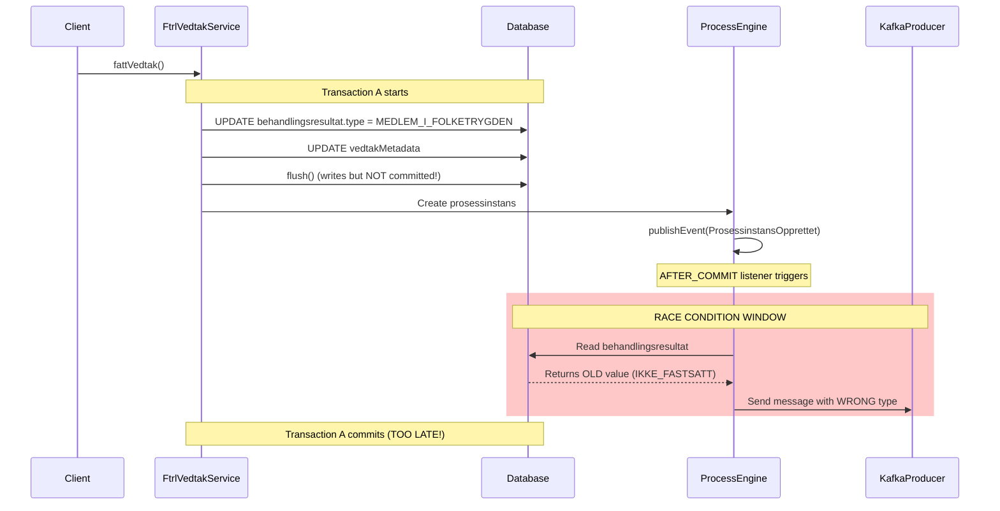
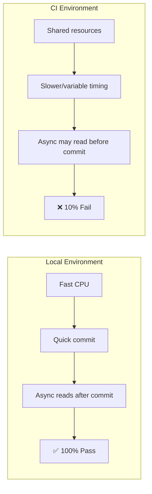
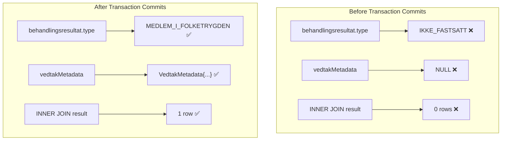
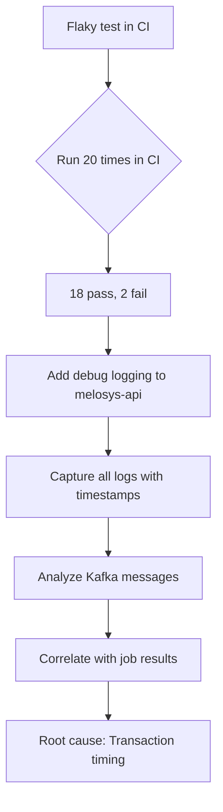
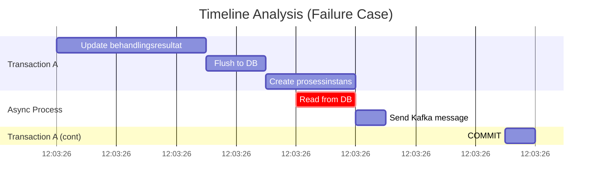
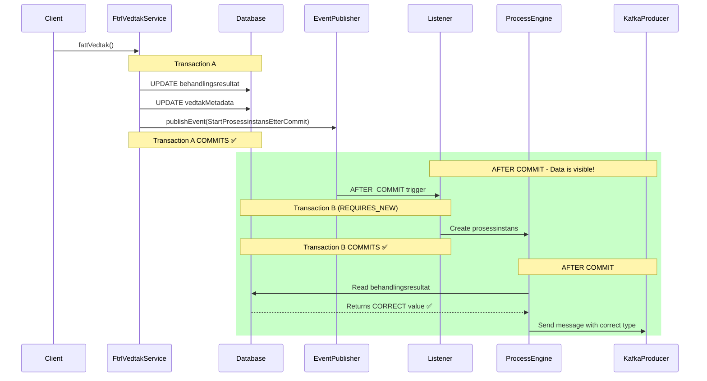
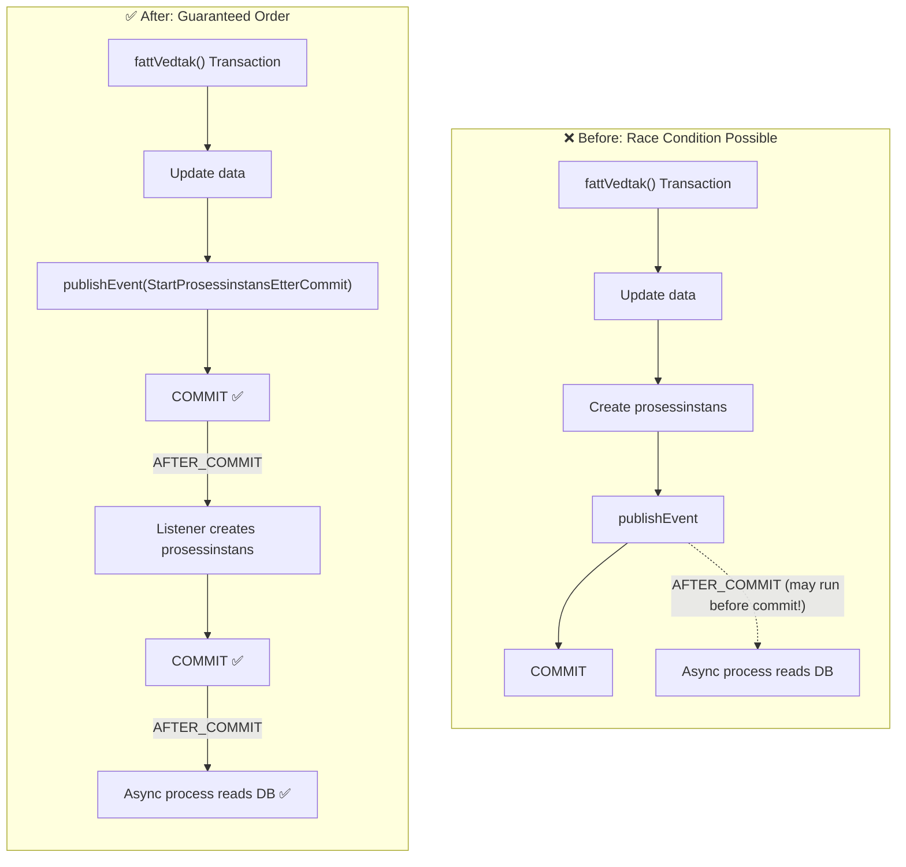
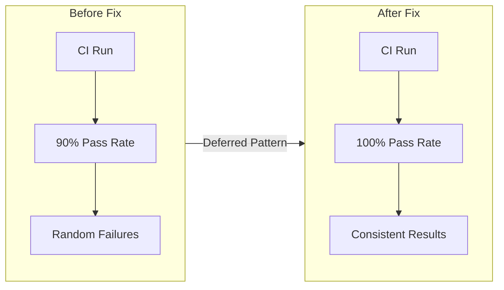

# Transaction Race Condition Bug Report

**JIRA:** MELOSYS-7718
**Status:** Root cause identified, fix implemented
**Severity:** HIGH - Affects billing accuracy (årsavregning)

---

## Executive Summary

A flaky E2E test revealed a **transaction visibility race condition** in melosys-api where async processes read stale data before the parent transaction commits.

| Metric | Value |
|--------|-------|
| CI Pass Rate | 90% (18/20) |
| Local Pass Rate | 100% |
| Root Cause | Transaction not committed before async read |
| Fix | Deferred Prosessinstans Pattern |

---

## 1. The Problem

### What Users Experience

When "nyvurdering" changes tax status from "skattepliktig" to "ikke-skattepliktig":
- The case should appear in the årsavregning job
- **Bug:** Sometimes it doesn't appear (10% of the time in CI)
- **Impact:** Missing billing corrections → financial discrepancies

### The Race Condition Visualized



### Why CI Fails But Local Passes



### Database Join Issue

The årsavregning job uses this query:

```sql
SELECT DISTINCT b FROM Behandlingsresultat br
JOIN br.behandling b
JOIN br.medlemskapsperioder mp
JOIN br.vedtakMetadata vm    -- ← INNER JOIN!
WHERE ...
```

**When transaction hasn't committed:**
- `vedtakMetadata` is `NULL`
- INNER JOIN returns 0 rows
- Job finds 0 cases



---

## 2. How We Debugged It

### Investigation Strategy



### Debug Logging Added

We added strategic logging to track the data flow:

```kotlin
// In oppdaterBehandlingsresultat()
logger.debug("🔍 DEBUG: Setter behandlingsresultat.type fra {} til {}",
    behandlingsresultat.type, beregnetType)

// After save
logger.debug("🔍 DEBUG: Lagret behandlingsresultat med type={}",
    behandlingsresultat.type)

// After flush
logger.debug("🔍 DEBUG: Flushed til database")
```

### Log Analysis Results

**Backend logs ALWAYS showed correct execution:**
```
🔍 DEBUG: Setter behandlingsresultat.type fra IKKE_FASTSATT til MEDLEM_I_FOLKETRYGDEN
🔍 DEBUG: Lagret behandlingsresultat med type=MEDLEM_I_FOLKETRYGDEN
🔍 DEBUG: Flushed til database
```

**But Kafka messages sometimes showed wrong value:**

| Kafka Message Type | Count | Job Result | Correlation |
|-------------------|-------|------------|-------------|
| `IKKE_FASTSATT` | 16 | 0 saker found | 100% wrong |
| `MEDLEM_I_FOLKETRYGDEN` | 32 | 1 sak found | 100% correct |

### Timestamp Correlation



**Key Finding:** The async process read the database at `12:03:26.180`, but the transaction didn't commit until `12:03:26.250` - a 70ms gap where stale data was visible.

---

## 3. The Solution: Deferred Prosessinstans Pattern

### Architecture Change



### Before vs After



### Code Change Summary

**Before (race condition possible):**
```kotlin
fun fattVedtak(behandling: Behandling, request: FattVedtakRequest) {
    oppdaterBehandlingsresultat(behandling, request)

    // Creates prosessinstans in SAME transaction
    // Async process may read before commit!
    prosessinstansService.opprettProsessinstansIverksettVedtakFTRL(
        behandling, request.tilVedtakRequest(), saksstatus
    )
}
```

**After (guaranteed order):**
```kotlin
fun fattVedtak(behandling: Behandling, request: FattVedtakRequest) {
    oppdaterBehandlingsresultat(behandling, request)

    // Publishes event - prosessinstans created AFTER commit
    applicationEventPublisher.publishEvent(
        StartProsessinstansEtterCommitEvent.IverksettVedtakFtrl(
            behandlingId = behandling.id,
            vedtakRequest = request.tilVedtakRequest(),
            saksstatus = saksstatus
        )
    )
}
```

### Listener Implementation

```kotlin
@Component
class StartProsessinstansEtterCommitListener(
    private val prosessinstansService: ProsessinstansService,
    private val behandlingService: BehandlingService
) {
    @Transactional(propagation = Propagation.REQUIRES_NEW) // New transaction!
    @TransactionalEventListener(phase = TransactionPhase.AFTER_COMMIT)
    fun opprettProsessinstansEtterCommit(event: StartProsessinstansEtterCommitEvent) {
        val behandling = behandlingService.hentBehandling(event.behandlingId)

        when (event) {
            is StartProsessinstansEtterCommitEvent.IverksettVedtakFtrl -> {
                prosessinstansService.opprettProsessinstansIverksettVedtakFTRL(
                    behandling, event.vedtakRequest, event.saksstatus
                )
            }
            // Handle other types...
        }
    }
}
```

---

## 4. Results

### Fix Verification



### Why This Works

1. **Transaction A commits first** - All data updates are visible
2. **Listener runs AFTER_COMMIT** - Guaranteed to see committed data
3. **REQUIRES_NEW transaction** - Ensures proper transaction boundaries
4. **Second AFTER_COMMIT** - Async process starts after prosessinstans is committed

---

## 5. Lessons Learned

### Key Takeaways

1. **Flaky tests often indicate real bugs** - Don't dismiss them
2. **CI vs Local differences** - Timing-sensitive bugs surface more in CI
3. **Debug logging is essential** - Timestamps reveal race conditions
4. **Transaction boundaries matter** - `flush()` ≠ `commit()`
5. **INNER JOINs amplify the problem** - NULL relationships cause 0 results

### When to Use Deferred Pattern

| Scenario | Use Deferred? |
|----------|---------------|
| Update data + start async process that reads it | ✅ Yes |
| Process reads data from DB | ✅ Yes |
| All data passed through process parameters | ❌ No |
| Synchronous operation in same transaction | ❌ No |

---

## Files Changed

| File | Change |
|------|--------|
| `saksflyt-api/.../StartProsessinstansEtterCommitEvent.kt` | New event class |
| `saksflyt/.../StartProsessinstansEtterCommitListener.kt` | New listener |
| `service/.../FtrlVedtakService.kt` | Use event instead of direct call |

---

## References

- **GitHub PR:** https://github.com/navikt/melosys-api/pull/3112
- **JIRA:** MELOSYS-7718
- **Spring Docs:** [TransactionalEventListener](https://docs.spring.io/spring-framework/reference/data-access/transaction/event.html)
