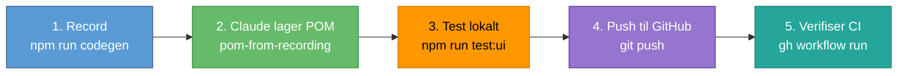
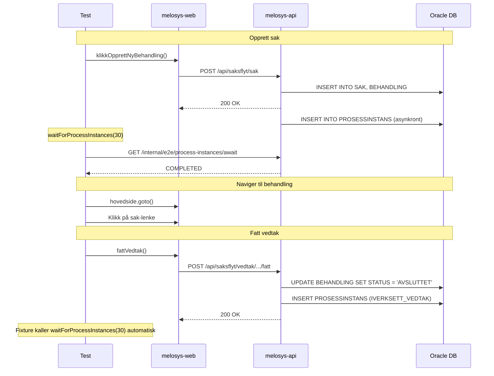
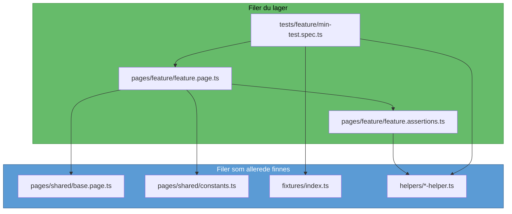

# Fra recording til POM-test

Oppskrift for å lage en ny E2E-test med Claude Code — fra Playwright-opptak til grønn CI.

## Oversikt



## Steg 1: Record arbeidsflyten

Start services og åpne codegen:

```bash
cd ../melosys-docker-compose && make start-all
npm run codegen
```

Utfør arbeidsflyten i nettleseren. Playwright Inspector genererer kode. Kopier den — du trenger den ikke direkte, men den gir Claude konteksten for hva som skal automatiseres.

## Steg 2: La Claude lage POM-test

Claude har en egen skill (`pom-from-recording`) som vet hvordan kodegenopptak konverteres til POM-baserte tester med riktig arkitektur. Be Claude om å lage testen:

```
Lag en ny E2E-test basert på dette opptaket: [lim inn codegen-kode]
Testen skal dekke [beskriv arbeidsflyten].
```

Claude vil:
- Gjenbruke eksisterende POMs (sjekker `pages/`-mappen først)
- Lage nye POMs kun for sider som ikke er dekket
- Bruke riktig `waitForProcessInstances`-mønster (se under)
- Importere fra `../../fixtures` (ikke `@playwright/test`)
- Legge til DB-verifikasjoner der det er relevant

### Hva du ikke trenger å tenke på

**Database-opprydding skjer automatisk.** Cleanup-fixturen rydder databasen, mock-data og Unleash-toggles *før* hver test. Du trenger aldri å rydde opp manuelt.

Det betyr at etter en test (også feilende tester) ligger all data igjen i databasen og UI-en. Du kan:
- Åpne `http://localhost:3000/melosys/` og se hva som ble opprettet
- Koble til Oracle-databasen og kjøre spørringer
- Sette et breakpoint i testen og inspisere tilstanden midt i flyten

```typescript
// Pause testen for å inspisere manuelt
await page.pause();  // Åpner Playwright Inspector — klikk "Resume" for å fortsette
```

### waitForProcessInstances — viktig å forstå

Når melosys-api oppretter en sak eller fatter vedtak, starter asynkrone bakgrunnsprosesser (IVERKSETT_VEDTAK, SEND_BREV, MOTTAK_SED). Testen må vente på disse før den navigerer videre.



**Reglene er enkle:**

| Situasjon | Hva du gjør |
|-----------|-------------|
| Etter `klikkOpprettNyBehandling()` | `await waitForProcessInstances(page.request, 30)` |
| Etter `fattVedtak()` som siste steg | Ingenting — fixturen håndterer det |
| Etter `fattVedtak()` og testen fortsetter | `await waitForProcessInstances(page.request, 60)` |
| Etter journalføring | `await waitForProcessInstances(page.request, 30)` |

## Steg 3: Test lokalt

```bash
# Interaktivt (anbefalt — ser testen kjøre i nettleseren)
npm run test:ui

# Eller kjør én spesifikk test
npx playwright test "test-navn" --project=chromium --reporter=list
```

Tips for feilsøking:
- **Trace:** `npm run show-trace` — se hvert steg med screenshot
- **Video:** `npm run open-videos` — se hva som faktisk skjedde
- **Pause:** Legg inn `await page.pause()` for å stoppe testen og inspisere

### Når ting ikke fungerer

Bruk `e2e-test-debugger`-skillen i Claude Code for systematisk feilsøking:

```
Testen feiler med timeout på "Fatt vedtak"-knappen. Hjelp meg debugge.
```

Claude vil da sjekke screenshots, database-tilstand (prosessinstanser, behandling, vedtak), og docker-logger for å finne årsaken.

## Steg 4: Push og lag PR

Når testen kjører grønt lokalt:

```bash
git checkout -b feature/ny-test-beskrivelse
git add tests/... pages/...
git commit -m "Legg til E2E-test for [beskrivelse]"
git push -u origin HEAD
```

## Steg 5: Verifiser på CI

Kjør testene på GitHub Actions for å sikre at de fungerer i CI-miljøet og ikke bryter eksisterende tester:

```bash
# Trigger E2E-tester for din branch
gh workflow run e2e-tests.yml --ref feature/ny-test-beskrivelse

# Følg med på kjøringen
gh run list --branch feature/ny-test-beskrivelse --limit 3
gh run watch  # Interaktivt — viser fremdrift
```

CI-miljøet bruker Intel-baserte maskiner med andre Docker-images enn lokalt. Ting som fungerer lokalt kan feile på CI pga:
- Tregere maskiner (timeout-verdier må være romslige)
- Annen Oracle-image (`XEPDB1` istedenfor `freepdb1`)
- Ingen GPU-akselerasjon for nettleseren

Bruk `gh-test-results`-skillen for å analysere CI-resultater:

```
Sjekk testresultatene for min branch
```

## Prosjektstruktur for nye tester



### Navnekonvensjoner

| Element | Mønster | Eksempel |
|---------|---------|----------|
| Test-fil | `tests/kategori/beskrivelse.spec.ts` | `tests/eu-eos/eu-eos-arbeid-flere-land.spec.ts` |
| Page Object | `pages/feature/feature.page.ts` | `pages/behandling/arbeid-flere-land-behandling.page.ts` |
| Assertions | `pages/feature/feature.assertions.ts` | `pages/behandling/arbeid-flere-land-behandling.assertions.ts` |
| Metoder (actions) | `fyllInn*`, `velg*`, `klikk*` | `fyllInnBrukerID()`, `velgSakstype()` |
| Metoder (assertions) | `verifiser*` | `verifiserBehandlingOpprettet()` |

## Sjekkliste

- [ ] Codegen-opptak utført
- [ ] Claude har laget POM-test med `pom-from-recording`-skill
- [ ] Importerer fra `../../fixtures` (ikke `@playwright/test`)
- [ ] `test.setTimeout(120000)` for tester med vedtak
- [ ] `waitForProcessInstances` etter saksopprettelse
- [ ] Ikke manuell `waitForProcessInstances` etter siste vedtak
- [ ] Bruker konstanter fra `pages/shared/constants.ts`
- [ ] Testen kjører grønt lokalt
- [ ] Pushet til GitHub og CI er grønn
- [ ] Eksisterende tester brytes ikke
