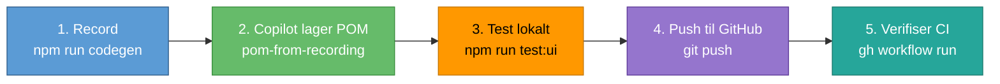
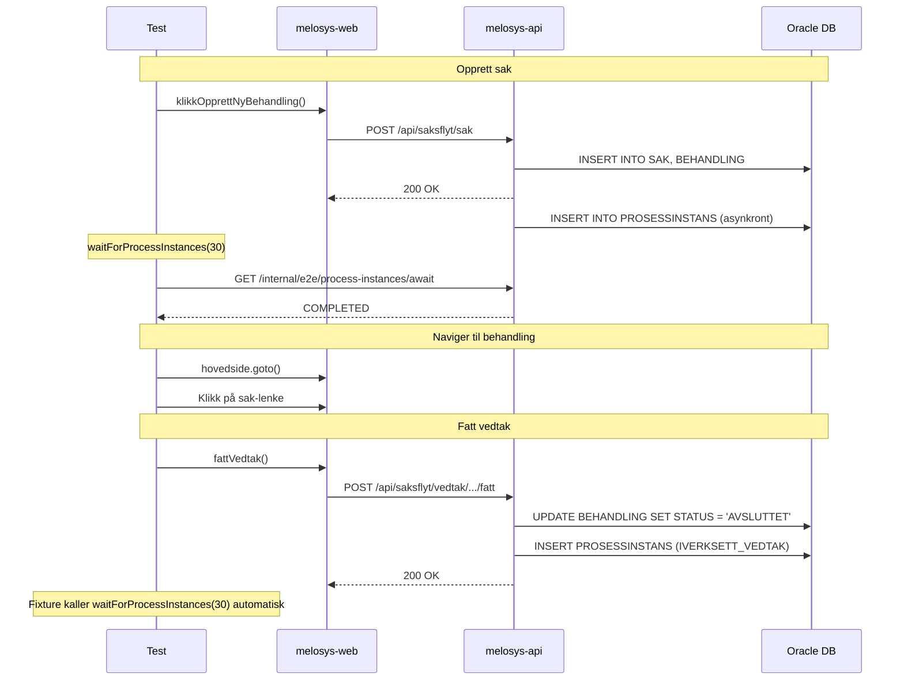
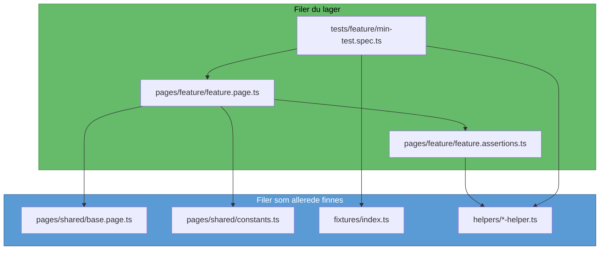

# Fra recording til POM-test

Oppskrift for å lage en ny E2E-test med Copilot — fra Playwright-opptak til grønn CI.

## Oversikt


```mermaid
graph LR
    A["1. Record\n npm run codegen"] --> B["2. Copilot lager POM\n pom-from-recording"]
    B --> C["3. Test lokalt\n npm run test:ui"]
    C --> D["4. Push til GitHub\n git push"]
    D --> E["5. Verifiser CI\n gh workflow run"]

    style A fill:#5B9BD5,stroke:#2E5C8A,color:#fff
    style B fill:#66BB6A,stroke:#388E3C,color:#fff
    style C fill:#FF9800,stroke:#C77700,color:#000
    style D fill:#9575CD,stroke:#5E3A99,color:#fff
    style E fill:#26A69A,stroke:#1A7A6E,color:#fff
```

## Steg 1: Record arbeidsflyten

Start services og åpne codegen:

```bash
cd ../melosys-docker-compose && make dev-eessi
npm run codegen
```

Utfør arbeidsflyten i nettleseren. Playwright Inspector genererer kode. Kopier den — du trenger den ikke direkte, men den gir Copilot konteksten for hva som skal automatiseres.

## Steg 2: La Copilot lage POM-test

Copilot har en egen skill (`pom-from-recording`) som vet hvordan kodegenopptak konverteres til POM-baserte tester med riktig arkitektur. Be Copilot om å lage testen:

```
Lag en ny E2E-test basert på dette opptaket: [lim inn codegen-kode]
Testen skal dekke [beskriv arbeidsflyten].
```

Copilot vil:
- Gjenbruke eksisterende POMs (sjekker `pages/`-mappen først)
- Lage nye POMs kun for sider som ikke er dekket
- Bruke riktig `waitForProcessInstances`-mønster (se under)
- Importere fra `../../fixtures` (ikke `@playwright/test`)
- Legge til DB-verifikasjoner der det er relevant

### Hva du ikke trenger å tenke på

**Database-opprydding skjer automatisk.** Cleanup-fixturen rydder databasen, mock-data og Unleash-toggles *før* hver test. Du trenger aldri å rydde opp manuelt.

Det betyr at etter en test (også feilende tester) ligger all data igjen i databasen og UI-en. Du kan:
- Åpne `http://localhost:3000/melosys/` og se hva som ble opprettet
- Koble til Oracle-databasen og kjøre spørringer
- Sette et breakpoint i testen og inspisere tilstanden midt i flyten

```typescript
// Pause testen for å inspisere manuelt
await page.pause();  // Åpner Playwright Inspector — klikk "Resume" for å fortsette
```

### waitForProcessInstances — viktig å forstå

Når melosys-api oppretter en sak eller fatter vedtak, starter asynkrone bakgrunnsprosesser (IVERKSETT_VEDTAK, SEND_BREV, MOTTAK_SED). Testen må vente på disse før den navigerer videre.


```mermaid
sequenceDiagram
    participant Test as Test
    participant UI as melosys-web
    participant API as melosys-api
    participant DB as Oracle DB

    Note over Test,DB: Opprett sak
    Test->>UI: klikkOpprettNyBehandling()
    UI->>API: POST /api/saksflyt/sak
    API->>DB: INSERT INTO SAK, BEHANDLING
    API-->>UI: 200 OK
    API->>DB: INSERT INTO PROSESSINSTANS (asynkront)

    Note over Test: waitForProcessInstances(30)
    Test->>API: GET /internal/e2e/process-instances/await
    API-->>Test: COMPLETED

    Note over Test,DB: Naviger til behandling
    Test->>UI: hovedside.goto()
    Test->>UI: Klikk på sak-lenke

    Note over Test,DB: Fatt vedtak
    Test->>UI: fattVedtak()
    UI->>API: POST /api/saksflyt/vedtak/.../fatt
    API->>DB: UPDATE BEHANDLING SET STATUS = 'AVSLUTTET'
    API->>DB: INSERT PROSESSINSTANS (IVERKSETT_VEDTAK)
    API-->>UI: 200 OK

    Note over Test: Fixture kaller waitForProcessInstances(30) automatisk
```

**Reglene er enkle:**

| Situasjon | Hva du gjør |
|-----------|-------------|
| Rundt en handling som starter en prosess | `await runAndWaitForProcessInstances(page.request, () => handling())` |
| Etter `fattVedtak()` som siste steg | Ingenting — fixturen håndterer det |
| Handlingen lar seg ikke pakke inn | `getProcessMarker()` FØR handlingen, så `waitForNewProcessInstances(request, markør)` |
| Lukke etterslep (oppgave/brev) før en DB-assert | `waitForProcessInstances(page.request, N)` — eneste gjenværende bruk av den markørløse |

`runAndWaitForProcessInstances` henter markør → kjører handlingen → venter på prosessene
*handlingen* startet. Bruk den — da kan ikke markøren havne på feil side av handlingen.

To ting å vite:

* **Handlingen må faktisk starte en prosessinstans.** Gjør den ikke det, venter serveren ut hele
  timeouten og kastet feilen sier «only 0 of 1 expected new process instance(s)». Skal du bare
  vente på at det som allerede kjører blir ferdig, er det tømming — bruk `expectedNew: 0`.
* **`timeoutSeconds` sendes nå til serveren.** Før var tallet kun Playwrights HTTP-timeout, og
  serveren ventet alltid sine egne 30 s. Ber du om 90, kan et kall som feiler nå blokkere i 90 s.

```typescript
await runAndWaitForProcessInstances(page.request, () => vedtak.klikkFattVedtak());

// Starter handlingen flere prosesser, si en per SED:
await runAndWaitForProcessInstances(page.request, () => sendAlleSed(), {expectedNew: 3});
```

#### Fallgruve: `waitForProcessInstances` venter ikke på prosesser som ikke finnes ennå

Den **markørløse** varianten (`waitForProcessInstances`) svarer COMPLETED så snart den ser
*noe* fullført arbeid — også instanser fra forrige steg (`recentInstances`, 60 s vindu).
Kalles den umiddelbart etter en UI-handling, kan den rekke å svare «alle N ferdige» før
handlingens egen instans er registrert, og da er ventingen verdiløs.

Observert på CI (kjøring 30331105445 og 30452518268): rett etter annullering svarte
endepunktet «8 av 8 ferdige» ~200 ms etter klikket, mens grønne kjøringer viste 9
instanser. ANNULLER_SAK-steget hadde altså ikke kjørt, krediteringen var ikke gjort, og
`expect(sum).toBe(0)` feilet med 121482.

Racet er reprodusert kunstig og målt: med `melosys.e2e.initial-settling-delay-ms=0` og en
treg backend løy den markørløse varianten i 9 av 10 forsøk, mens markør-varianten traff
0 av 10 (`scripts/prosessinstans-race-repro.ts`).

**Derfor: bruk `runAndWaitForProcessInstances`.** Den tar en markør før handlingen, og
serveren krever da at minst én prosessinstans registrert *etter* markøren finnes og er
FERDIG. Forrige stegs arbeid kan ikke oppfylle den.

`expectedInstances=N` (gammel parameter) løser ikke dette: kravet er «minst N instanser
**totalt** i 60 s-vinduet», ikke N *nye* siden handlingen din. Den kan ikke kombineres med
`after` — serveren svarer 400 om du prøver.

Leser du tilstand som settes *etter* at instansen er registrert — særlig i en annen
tjeneste — poll på den faktiske tilstanden i stedet:

```typescript
// I stedet for å lese kjeden rett etter waitForProcessInstances:
const serier = await faktureringHelper.ventPåKjedeSum(
  [opprinneligRef, arsavregningRef],
  0
); // poller inntil 30 s, og holder seg innenfor budsjettet (hvert kall får kun resten
   // av det). Kaster ved ugyldige argumenter, ved sentinel-referansen «Kansellert», og
   // når den aldri fikk noe å måle på – enten fordi tjenesten ikke svarte, eller fordi
   // kjeden manglet fakturalinjer (en sum-assertion ville vært vakuøs). Ellers
   // returneres siste brukbare kjede, så expect gir feilmeldingen.
expect(faktureringHelper.avrundBelop(faktureringHelper.totalBelopKjede(serier))).toBe(0);
```

Merk at krediteringen mot faktureringskomponenten i seg selv er **synkron** (steget kaller
REST og blokkerer), så her er det registreringen av prosessinstansen vi venter på. For
melosys-eessi, som er Kafka-basert, kommer i tillegg den ekte kryss-tjeneste-forsinkelsen.

## Steg 3: Test lokalt

```bash
# Interaktivt (anbefalt — ser testen kjøre i nettleseren)
npm run test:ui

# Eller kjør én spesifikk test
npx playwright test "test-navn" --project=chromium --reporter=list
```

Tips for feilsøking:
- **Trace:** `npm run show-trace` — se hvert steg med screenshot
- **Video:** `npm run open-videos` — se hva som faktisk skjedde
- **Pause:** Legg inn `await page.pause()` for å stoppe testen og inspisere

### Når ting ikke fungerer

Bruk `e2e-test-debugger`-skillen i Copilot for systematisk feilsøking:

```
Testen feiler med timeout på "Fatt vedtak"-knappen. Hjelp meg debugge.
```

Copilot vil da sjekke screenshots, database-tilstand (prosessinstanser, behandling, vedtak), og docker-logger for å finne årsaken.

## Steg 4: Push og lag PR

Når testen kjører grønt lokalt:

```bash
git checkout -b feature/ny-test-beskrivelse
git add tests/... pages/...
git commit -m "Legg til E2E-test for [beskrivelse]"
git push -u origin HEAD
```

## Steg 5: Verifiser på CI

Kjør testene på GitHub Actions for å sikre at de fungerer i CI-miljøet og ikke bryter eksisterende tester:

```bash
# Trigger E2E-tester for din branch
gh workflow run e2e-tests.yml --ref feature/ny-test-beskrivelse

# Følg med på kjøringen
gh run list --branch feature/ny-test-beskrivelse --limit 3
gh run watch  # Interaktivt — viser fremdrift
```

CI-miljøet bruker Intel-baserte maskiner med andre Docker-images enn lokalt. Ting som fungerer lokalt kan feile på CI pga:
- Tregere maskiner (timeout-verdier må være romslige)
- Annen Oracle-image (`XEPDB1` istedenfor `freepdb1`)
- Ingen GPU-akselerasjon for nettleseren

Bruk `gh-test-results`-skillen for å analysere CI-resultater:

```
Sjekk testresultatene for min branch
```

## Prosjektstruktur for nye tester


```mermaid
graph TD
    subgraph Nye_filer["Filer du lager"]
        Test["tests/feature/min-test.spec.ts"]
        POM["pages/feature/feature.page.ts"]
        Assert["pages/feature/feature.assertions.ts"]
    end

    subgraph Eksisterende["Filer som allerede finnes"]
        Base["pages/shared/base.page.ts"]
        Const["pages/shared/constants.ts"]
        Fix["fixtures/index.ts"]
        Helpers["helpers/*-helper.ts"]
    end

    Test --> POM
    Test --> Fix
    Test --> Helpers
    POM --> Base
    POM --> Assert
    POM --> Const
    Assert --> Helpers

    style Nye_filer fill:#66BB6A,stroke:#388E3C,color:#000
    style Eksisterende fill:#5B9BD5,stroke:#2E5C8A,color:#fff
```

### Navnekonvensjoner

| Element | Mønster | Eksempel |
|---------|---------|----------|
| Test-fil | `tests/kategori/beskrivelse.spec.ts` | `tests/eu-eos/eu-eos-arbeid-flere-land.spec.ts` |
| Page Object | `pages/feature/feature.page.ts` | `pages/behandling/arbeid-flere-land-behandling.page.ts` |
| Assertions | `pages/feature/feature.assertions.ts` | `pages/behandling/arbeid-flere-land-behandling.assertions.ts` |
| Metoder (actions) | `fyllInn*`, `velg*`, `klikk*` | `fyllInnBrukerID()`, `velgSakstype()` |
| Metoder (assertions) | `verifiser*` | `verifiserBehandlingOpprettet()` |

## Sjekkliste

- [ ] Codegen-opptak utført
- [ ] Copilot har laget POM-test med `pom-from-recording`-skill
- [ ] Importerer fra `../../fixtures` (ikke `@playwright/test`)
- [ ] `test.setTimeout(120000)` for tester med vedtak
- [ ] `runAndWaitForProcessInstances` rundt saksopprettelsen (ikke markørløs venting etterpå)
- [ ] Ingen manuell venting etter siste vedtak — fixturen håndterer det
- [ ] Bruker konstanter fra `pages/shared/constants.ts`
- [ ] Testen kjører grønt lokalt
- [ ] Pushet til GitHub og CI er grønn
- [ ] Eksisterende tester brytes ikke
