# SaksopplysningKilde Race Condition — Complete Fix Documentation

**Date:** 2026-02-25 (updated 2026-02-26)
**Status:** fix-7 validated — 0 failures across 240+ test runs (3 consecutive CI runs)
**PRs:**
- melosys-api: [#3233](https://github.com/navikt/melosys-api/pull/3233)
- melosys-web: [#3022](https://github.com/navikt/melosys-web/pull/3022)

## Problem

76.5% of CI runs had at least one flaky "arbeid i flere land" test. The failure manifests as:

```
TimeoutError: waiting for getByRole('checkbox', { name: 'Ståles Stål AS' }) to be visible
```

The checkbox never appears because `RegisteropplysningerService` fails with `OptimisticLockingFailureException`, preventing arbeidsforhold data from loading.

```
ERROR | Row was updated or deleted by another transaction
  [no.nav.melosys.domain.SaksopplysningKilde#66]
```

## Root Cause

Two concurrent HTTP requests from the **same browser** both call `RegisteropplysningerService.hentOgLagreOpplysninger()` for the same behandling. Both remove and recreate `Saksopplysning`/`SaksopplysningKilde` entities simultaneously. The second transaction fails on commit.

### The Two Requests


### Race Timeline

```mermaid
sequenceDiagram
    participant U as User / E2E Test
    participant R as React (vurderingVedtak)
    participant T1 as Backend Thread 1<br/>(kontroll)
    participant T2 as Backend Thread 2<br/>(vedtak)
    participant DB as Database

    U->>R: Navigate to vedtak step
    Note over R: mottatteOpplysningerStatus → "OK"
    R->>R: useEffect triggers<br/>debounce(kontroller, 500ms)

    Note over R: ~500ms passes

    R->>T1: POST /kontroll/ferdigbehandling<br/>(skalRegisteropplysningerOppdateres=true)
    activate T1
    T1->>DB: BEGIN TRANSACTION
    T1->>DB: DELETE FROM saksopplysning_kilde<br/>WHERE behandling_id = 11
    T1->>DB: INSERT INTO saksopplysning_kilde<br/>(new register data)

    U->>R: Click "Fatt vedtak"
    R->>T2: POST /saksflyt/vedtak/11/fatt
    activate T2
    T2->>DB: BEGIN TRANSACTION
    T2->>DB: DELETE FROM saksopplysning_kilde<br/>WHERE behandling_id = 11

    T1->>DB: COMMIT ✅
    deactivate T1

    T2->>DB: INSERT INTO saksopplysning_kilde
    T2->>DB: COMMIT ❌ OptimisticLockingFailureException
    deactivate T2

    T2-->>R: HTTP 500
    Note over R: Vedtak fails, arbeidsforhold<br/>not loaded → checkbox timeout
```



### Actual API Recording from Failing Run

```
#81  req@18076ms  resp@18314ms (238ms)  POST /api/kontroll/ferdigbehandling → 200
#82  req@18272ms  resp@18402ms (130ms)  POST /api/saksflyt/vedtak/11/fatt → 500 💥
                  ←── 42ms overlap ──→
```

### Actual Docker Logs from Failing Run

```
10:57:35.413 | f610e5d5 | RegisteropplysningerService | Medlemskap hentet for behandling 11  ← kontroll thread
10:57:35.592 | 2c659c6a | EosVedtakService            | Fatter vedtak for (EU_EØS) sak: MEL-11
10:57:35.606 | 2c659c6a | RegisteropplysningerService | Medlemskap hentet for behandling 11  ← vedtak thread
10:57:35.712 | 2c659c6a | ExceptionMapper              | ERROR | SaksopplysningKilde#66     ← 💥 CRASH
```

## Frontend Code Analysis

### How the debounced kontroll fires (vurderingVedtak.tsx)

```typescript
// Line 164 — true only for FIRST kontroll call per component mount
let oppdaterFørKontroll = true;

// Line 201 — kontroll function
async function kontroller(data) {
  if (redigerbart && data.mottatteOpplysningerStatus === "OK" && data.aktivtSteg) {
    const request = {
      // First call: true → triggers RegisteropplysningerService on backend
      // Subsequent calls: false → read-only kontroll (no race risk)
      skalRegisteropplysningerOppdateres: oppdaterFørKontroll,
    };
    oppdaterFørKontroll = false;
    await dispatch(kontrollOperations.kontrollerFerdigbehandling(request));
  }
}

// Line 223 — debounced at 500ms, memoized once on mount
const debouncedKontrollerBehandling = useCallback(Utils._debounce(kontroller, 500), []);

// Line 225 — fires on status/form changes
useEffect(() => {
  debouncedKontrollerBehandling({ aktivtSteg, formValues, mottatteOpplysningerStatus });
}, [redigerbart, formIsValid, aktivtSteg, formValues?.kopiTilArbeidsgiver,
    mottatteOpplysningerStatus]);
```

### How onSubmit triggers the race (BEFORE fix)

```typescript
// Line 238 — NO cancel of debounced kontroll!
const onSubmit = async () => {
  if (!validerForm()) return;
  setVedtakPending(true);
  validerMottatteOpplysninger()         // calls lagreAllData() → POST /mottatteopplysninger
    .then(() => {
      dispatch(vedtakOperations.fatt(   // POST /vedtak/fatt — races with debounced kontroll
        behandlingID, vedtakRequest
      ));
    });
};
```

### Why vedtak/fatt always calls RegisteropplysningerService


Note: `kontrollerVedtakMedRegisteropplysninger` has no `skalRegisteropplysningerOppdateres` flag — it **always** refreshes register data. This is by design: the vedtak endpoint ensures data is fresh before committing a vedtak.

## Previous Investigation (Nov 2025)

The exact same pattern was identified in November 2025 (`melosys-web/docs/debugging/2025-11-28-FRONTEND-FIX-CANCEL-DEBOUNCE.md`), but for a different entity (`behandlingsresultat`). The proposed fix (cancel debounce + 200ms delay) was documented but **never merged**.

## The Fix (Two Parts)

### Part 1: Frontend — Cancel debounced kontroll (melosys-web)

**File:** `src/sider/eu_eøs/stegKomponenter/vurderingVedtak/vurderingVedtak.tsx`

```typescript
const onSubmit = async () => {
  // Cancel any pending debounced kontroll to prevent concurrent HTTP requests
  // that race with vedtak/fatt on SaksopplysningKilde entities
  debouncedKontrollerBehandling.cancel?.();

  if (!validerForm()) return;
  setVedtakPending(true);

  try {
    await validerMottatteOpplysninger();
    const vedtakRequest = { /* ... */ };
    const res = await dispatch(vedtakOperations.fatt(behandlingID, vedtakRequest));
    if (res.data?.data?.error) setVedtakPending(false);
  } catch {
    setVedtakPending(false);
  }
};
```

**What it does:**
- Cancels the debounced kontroll timer before proceeding with vedtak
- Prevents the concurrent `kontroll/ferdigbehandling` HTTP request
- `vedtak/fatt` already runs kontroll internally, so the frontend kontroll is redundant at submit time

**What it does NOT do:**
- Does not cancel already in-flight HTTP requests (would need AbortController)
- Does not change backend behavior

### Part 2: Backend — Lock + debounce in RegisteropplysningerService (melosys-api)

**File:** `service/src/main/java/no/nav/melosys/service/registeropplysninger/RegisteropplysningerService.java`

```java
private static final ConcurrentHashMap<Long, ReentrantLock> behandlingLocks = new ConcurrentHashMap<>();

@Transactional
public void hentOgLagreOpplysninger(RegisteropplysningerRequest request) {
    // ... validation ...
    long behandlingId = request.getBehandlingID();

    // Application-level lock: tryLock() returns immediately if another thread
    // is already running hentOgLagreOpplysninger for the same behandling.
    var lock = behandlingLocks.computeIfAbsent(behandlingId, k -> new ReentrantLock());
    if (!lock.tryLock()) {
        log.info("Registeropplysninger hentes allerede for behandling {}, hopper over", behandlingId);
        return;
    }

    // Release lock AFTER transaction completes (not in finally block!)
    TransactionSynchronizationManager.registerSynchronization(new TransactionSynchronization() {
        @Override
        public void afterCompletion(int status) {
            lock.unlock();
            behandlingLocks.remove(behandlingId);
        }
    });

    Behandling behandling = behandlingService.hentBehandlingMedSaksopplysninger(behandlingId);

    // Debounce: skip if register data was just fetched (catches sequential near-duplicates)
    if (behandling.getSisteOpplysningerHentetDato() != null
            && Duration.between(behandling.getSisteOpplysningerHentetDato(),
                Instant.now()).getSeconds() < 2) {
        log.info("Registeropplysninger nylig hentet for behandling {}, hopper over", behandlingId);
        return;
    }

    hentOgLagreOpplysninger(request, behandling);
}
```

**What it does (fix-7 — final version):**

Two layers of protection:

1. **Application-level lock** (`ConcurrentHashMap` + `ReentrantLock` per behandling-ID): `tryLock()` returns immediately if another thread is already running `hentOgLagreOpplysninger` for the same behandling. The lock is released via `TransactionSynchronization.afterCompletion()` — AFTER the transaction commits, not in a finally block.

2. **Debounce check** (`sisteOpplysningerHentetDato` < 2 seconds): Catches sequential near-duplicate calls that don't overlap but happen shortly after each other.

```mermaid
flowchart TD
    A[hentOgLagreOpplysninger called] --> B{tryLock for<br/>this behandling?}
    B -->|No — another thread<br/>holds the lock| C[LOG: hentes allerede, hopper over]
    C --> D[return early ✅]
    B -->|Yes — lock acquired| E[Register afterCompletion<br/>to unlock after TX commit]
    E --> F[Load behandling<br/>from database]
    F --> G{sisteOpplysningerHentetDato<br/>< 2 seconds ago?}
    G -->|Yes| H[LOG: nylig hentet, hopper over]
    H --> I[return early ✅<br/>lock released on TX complete]
    G -->|No or null| J[Fetch from AAREG/MEDL]
    J --> K[removeIf old Saksopplysning]
    K --> L[Save new Saksopplysning]
    L --> M[Set sisteOpplysningerHentetDato = now]
    M --> N["@Transactional COMMIT ✅"]
    N --> O[afterCompletion: unlock]

    style C fill:#4a4,color:#fff
    style D fill:#4a4,color:#fff
    style H fill:#4a4,color:#fff
    style I fill:#4a4,color:#fff
    style O fill:#69f,color:#fff
```



## Why Both Fixes Are Needed


### CI Results

| Run | Configuration | Tests | Failed | Rate |
|-----|--------------|-------|--------|------|
| Previous baseline | latest (no fix) | 34 runs | 26 | **76.5%** |
| [22392940208](https://github.com/navikt/melosys-e2e-tests/actions/runs/22392940208) | web:fix-5 only | 60 | ~10 | **~17%** |
| [22396622532](https://github.com/navikt/melosys-e2e-tests/actions/runs/22396622532) | fix-5 (debounce only) | 77 | 3 | **3.75%** |
| [22415716297](https://github.com/navikt/melosys-e2e-tests/actions/runs/22415716297) | fix-6 (lock in finally) | 80 | 2 | **2.5%** |
| [22431015533](https://github.com/navikt/melosys-e2e-tests/actions/runs/22431015533) | **fix-7 (lock after TX)** | 80 | 0 | **0%** |
| [22432730859](https://github.com/navikt/melosys-e2e-tests/actions/runs/22432730859) | **fix-7 (lock after TX)** | 80 | 0 | **0%** |
| [22433426547](https://github.com/navikt/melosys-e2e-tests/actions/runs/22433426547) | **fix-7 (lock after TX)** | 80 | 0 | **0%** |
| [22434539832](https://github.com/navikt/melosys-e2e-tests/actions/runs/22434539832) | **fix-7 (lock after TX)** | 80 | TBD | TBD |

**fix-7 validated: 0/240 failures across 3 consecutive runs** (4th run in progress).

See [fix iteration details](#latest-findings-debounce-has-a-toctou-gap) below for why earlier fix versions failed.

## Latest Findings: Debounce Has a TOCTOU Gap

### Run 22396622532 — 3 failures despite both fixes

The run with `melosys-api:fix-5` + `melosys-web:fix-5` and 20 repeats showed **3 failures out of 77 completed tests (3.75%)**. The debounce was bypassed in all 3 cases.

### Evidence: Both threads read before either commits

```
12:32:26.431 | de08d404 | RegisteropplysningerService | Medlemskap hentet for behandling 15  ← Thread A
12:32:26.601 | 9083fb60 | EosVedtakService            | Fatter vedtak for behandling 15     ← Thread B starts
12:32:26.612 | 9083fb60 | RegisteropplysningerService | Medlemskap hentet for behandling 15  ← Thread B (NOT skipped!)
12:32:26.714 | 9083fb60 | ExceptionMapper              | ERROR SaksopplysningKilde#85       ← 💥
```

Thread A fetched at 12:32:26.431. Thread B fetched at 12:32:26.612 (181ms later). The debounce did NOT skip Thread B because Thread A hadn't committed yet — Thread B read `sisteOpplysningerHentetDato` from the database and saw the OLD value (before Thread A's update).

### The TOCTOU (Time-Of-Check-Time-Of-Use) Problem

```mermaid
sequenceDiagram
    participant A as Thread A (kontroll)
    participant DB as Database
    participant B as Thread B (vedtak)

    A->>DB: SELECT behandling<br/>(sisteOpplysningerHentetDato = old)
    A->>A: Check: old > 2s ago → proceed
    A->>DB: DELETE + INSERT saksopplysning_kilde

    Note over A,B: Thread B reads BEFORE Thread A commits

    B->>DB: SELECT behandling<br/>(sisteOpplysningerHentetDato = old)
    B->>B: Check: old > 2s ago → proceed ← DEBOUNCE BYPASSED
    B->>DB: DELETE + INSERT saksopplysning_kilde

    A->>DB: COMMIT ✅ (sets sisteOpplysningerHentetDato = now)
    B->>DB: COMMIT ❌ OptimisticLockingFailureException
```



The debounce reads `sisteOpplysningerHentetDato` from the database, but the timestamp is only updated when the transaction commits. If both threads read before either commits, both see the old timestamp and both proceed.

### Debounce statistics from run 22396622532

| Metric | Count |
|--------|-------|
| Debounce skips ("nylig hentet, hopper over") | 23 |
| Total Medlemskap fetches | 143 |
| Races where debounce prevented crash | ~23 |
| Races where both threads overlapped before commit | 3 |
| **Debounce effectiveness** | **~88% of concurrent calls prevented** |

### Effectiveness across all CI runs

| Run | Config | Tests | Failures | Rate | Notes |
|-----|--------|-------|----------|------|-------|
| Baseline (no fix) | latest | 34 runs | 26 | **76.5%** | Per-run failure rate |
| [22390008907](https://github.com/navikt/melosys-e2e-tests/actions/runs/22390008907) | api:fix-5 + web:fix-5 | 60 | 0 | **0%** | Lucky — no overlapping reads |
| [22394409152](https://github.com/navikt/melosys-e2e-tests/actions/runs/22394409152) | api:fix-5 + web:fix-5 | 106* | 0 | **0%** | *cancelled at timeout |
| [22396622532](https://github.com/navikt/melosys-e2e-tests/actions/runs/22396622532) | api:fix-5 + web:fix-5 | 77 | 3 | **3.75%** | TOCTOU gap hit 3 times |
| [22392940208](https://github.com/navikt/melosys-e2e-tests/actions/runs/22392940208) | web:fix-5 only | 60 | ~10 | **~17%** | Frontend fix alone insufficient |

**The fix reduces failure rate from ~47% to ~3.75%**, but does not eliminate it.

### fix-6: Application-level lock — still fails (lock releases before TX commit)

Run [22415716297](https://github.com/navikt/melosys-e2e-tests/actions/runs/22415716297) with `melosys-api:fix-6` (ConcurrentHashMap + tryLock) showed **2 flaky tests** (1 failure each out of 20 attempts), with SaksopplysningKilde errors still in docker logs.

**Why the lock didn't work:** The `@Transactional` proxy wraps the method. The lock is acquired INSIDE the transaction, and `unlock()` in the `finally` block runs BEFORE the proxy commits:

```mermaid
sequenceDiagram
    participant P as Spring @Transactional Proxy
    participant M as Method Body
    participant DB as Database

    P->>DB: BEGIN TRANSACTION
    P->>M: enter method
    M->>M: tryLock() ✅
    M->>DB: DELETE + INSERT saksopplysninger
    M->>M: finally: unlock() ← Lock released HERE
    M-->>P: return
    P->>DB: COMMIT ← But TX commits HERE (after unlock!)
```



Thread B acquires the lock after Thread A unlocks but before Thread A's transaction commits → reads stale `sisteOpplysningerHentetDato` → proceeds → crash.

### fix-7: TransactionSynchronization — lock released after TX commit

Instead of unlocking in a `finally` block, use `TransactionSynchronization.afterCompletion()`:

```java
var lock = behandlingLocks.computeIfAbsent(behandlingId, k -> new ReentrantLock());
if (!lock.tryLock()) {
    log.info("Registeropplysninger hentes allerede for behandling {}, hopper over", behandlingId);
    return;
}

// Release lock AFTER transaction completes (commit or rollback)
TransactionSynchronizationManager.registerSynchronization(new TransactionSynchronization() {
    @Override
    public void afterCompletion(int status) {
        lock.unlock();
        behandlingLocks.remove(behandlingId);
    }
});
```



```mermaid
sequenceDiagram
    participant P as Spring @Transactional Proxy
    participant M as Method Body
    participant DB as Database

    P->>DB: BEGIN TRANSACTION
    P->>M: enter method
    M->>M: tryLock() ✅
    M->>M: register afterCompletion callback
    M->>DB: DELETE + INSERT saksopplysninger
    M-->>P: return
    P->>DB: COMMIT ✅
    P->>M: afterCompletion → unlock() ← Lock released AFTER commit
```

Now Thread B's `tryLock()` returns false until Thread A's transaction has fully committed. The data is consistent when Thread B reads it.

### Updated CI Results (all fix iterations)

| Run | Fix | Tests | Failures | Rate | Notes |
|-----|-----|-------|----------|------|-------|
| Baseline | none (latest) | 34 runs | 26 | **76.5%** | Per-run failure rate |
| [22392940208](https://github.com/navikt/melosys-e2e-tests/actions/runs/22392940208) | web:fix-5 only | 60 | ~10 | **~17%** | Frontend fix alone insufficient |
| [22396622532](https://github.com/navikt/melosys-e2e-tests/actions/runs/22396622532) | fix-5 (debounce only) | 77 | 3 | **3.75%** | TOCTOU gap |
| [22390008907](https://github.com/navikt/melosys-e2e-tests/actions/runs/22390008907) | fix-5 (debounce only) | 60 | 0 | **0%** | Lucky — no overlapping reads |
| [22394409152](https://github.com/navikt/melosys-e2e-tests/actions/runs/22394409152) | fix-5 (debounce only) | 106* | 0 | **0%** | *cancelled at timeout |
| [22412734167](https://github.com/navikt/melosys-e2e-tests/actions/runs/22412734167) | fix-6 (lock in finally) | 80 | 0 | **0%** | Lucky |
| [22415716297](https://github.com/navikt/melosys-e2e-tests/actions/runs/22415716297) | fix-6 (lock in finally) | 80 | 2 | **2.5%** | Lock releases before TX commit |
| [22417209214](https://github.com/navikt/melosys-e2e-tests/actions/runs/22417209214) | fix-6 (lock in finally) | 80 | 3 | **3.75%** | Same issue |
| [22431015533](https://github.com/navikt/melosys-e2e-tests/actions/runs/22431015533) | **fix-7 (lock after TX)** | 80 | 0 | **0%** | All passed |
| [22432730859](https://github.com/navikt/melosys-e2e-tests/actions/runs/22432730859) | **fix-7 (lock after TX)** | 80 | 0 | **0%** | All passed |
| [22433426547](https://github.com/navikt/melosys-e2e-tests/actions/runs/22433426547) | **fix-7 (lock after TX)** | 80 | 0 | **0%** | All passed |
| [22434539832](https://github.com/navikt/melosys-e2e-tests/actions/runs/22434539832) | **fix-7 (lock after TX)** | 80 | TBD | TBD | Validation run 4 |

### Options considered to fully eliminate the race

#### Option B: Application-level lock ✅ IMPLEMENTED (fix-7)

This is what we shipped. See [fix-7 section above](#fix-7-transactionsynchronization--lock-released-after-tx-commit).

Key insight: the lock must be released AFTER the transaction commits, not in a `finally` block. `TransactionSynchronization.afterCompletion()` achieves this.

**Unit test impact:** `TransactionSynchronizationManager.registerSynchronization()` requires an active synchronization context. Unit tests need `TransactionSynchronizationManager.initSynchronization()` in `@BeforeEach` and `clearSynchronization()` in `@AfterEach`.

#### Option A: Database-level lock (SELECT FOR UPDATE) — not needed

Add a pessimistic lock when reading the behandling:

```java
// In RegisteropplysningerService or a new method in BehandlingService
@Lock(LockModeType.PESSIMISTIC_WRITE)
@Query("SELECT b FROM Behandling b WHERE b.id = :id")
Behandling hentBehandlingForUpdate(@Param("id") long id);
```

Thread B would block until Thread A commits, then read the updated timestamp and skip via debounce.

**Pros:** Deterministic, eliminates the race entirely.
**Cons:** Adds lock contention. Could cause deadlocks if other code also locks behandling in a different order. Increases latency for concurrent calls.

#### Option C: Increase debounce + add retry (pragmatic) — not needed

Combine the current debounce with a retry at the caller level:

1. Keep the 2-second debounce (catches ~88% of cases)
2. Add `@Retryable` on a **separate bean** that wraps `RegisteropplysningerService` (avoids the `@Transactional` + `@Retryable` same-method issue)
3. The retry catches the remaining ~12% where TOCTOU bites

**Pros:** No locking, handles the edge case gracefully.
**Cons:** More complex, retry adds latency on failure.

#### Production considerations (multiple pods)

The application-level lock only works within a single JVM. In production with multiple pods, two requests for the same behandling could land on different pods. However:
- In production, the debounce alone provides sufficient protection since concurrent requests for the same behandling from different pods are extremely rare
- The race condition is primarily a CI/E2E issue where a single melosys-api instance handles all traffic
- If needed in the future, Option A (SELECT FOR UPDATE) could be added as well

## Could This Break Something?

### Frontend fix: Cancel debounced kontroll

**Risk: Low.** The cancel only prevents a *pending* debounced kontroll from firing. The kontroll is purely a pre-validation check — it shows warning banners in the UI if there are kontroll errors. When the user clicks "Fatt vedtak":

1. The vedtak endpoint runs its own `kontrollerVedtakMedRegisteropplysninger` internally
2. If kontroll fails, the vedtak endpoint throws `ValideringException` and returns errors to the UI
3. The user sees the same kontroll errors regardless of whether the frontend kontroll ran


**Edge case:** If the user clicks "Fatt vedtak" within 500ms of navigating to the vedtak step, the first kontroll (with `oppdaterFørKontroll=true`) is cancelled. This means the kontroll warning banners don't appear before the user submits. But the vedtak endpoint's internal kontroll catches the same errors, so the user still gets feedback.

**What about the other vedtak components?** The same pattern exists in 5 other components (listed in the PR). They should get the same fix, but the race condition primarily affects EU/EOS "arbeid i flere land" flows because those are the ones that exercise `RegisteropplysningerService` most heavily.

### Backend fix: Debounce in RegisteropplysningerService

**Risk: Very low.** The debounce only skips fetching register data that was already fetched less than 2 seconds ago. Analysis of when this matters:

| Scenario | Impact | Risk |
|----------|--------|------|
| **Normal user workflow** | User navigates steps, fills form over minutes. No debounce triggered. | None |
| **Manual "Oppfrisk" click** | Goes through `OppfriskSaksopplysningerService` which calls `slettRegisterOpplysninger` first, resetting `sisteOpplysningerHentetDato` implicitly via new saksopplysninger. | None |
| **Concurrent kontroll + vedtak** | Second call skipped — identical data would be fetched. | None (intended) |
| **Register data actually changed within 2s** | Stale data for up to 2 seconds. In practice, AAREG/MEDL data changes on hours/days timescale, not seconds. | Negligible |
| **Multiple behandlinger** | Each behandling has its own `sisteOpplysningerHentetDato`. Debounce only affects same behandling. | None |
| **Saksflyt async thread** | `HENT_REGISTEROPPLYSNINGER` step runs during sak creation, minutes before vedtak. No debounce triggered. | None |

```mermaid
graph TD
    A[Who calls RegisteropplysningerService?] --> B[Saksflyt: HENT_REGISTEROPPLYSNINGER<br/>During sak creation<br/>Minutes before vedtak]
    A --> C[Frontend: kontroll/ferdigbehandling<br/>Debounced useEffect<br/>On vedtak step]
    A --> D[Vedtak: EosVedtakService.fattVedtak<br/>Always calls kontrollerVedtak<br/>MedRegisteropplysninger]
    A --> E[Oppfrisk: OppfriskSaksopplysningerService<br/>Manual refresh button<br/>Deletes + re-fetches]

    B --> F{Debounce triggered?}
    F -->|No — minutes apart| G[Normal flow ✅]

    C --> H{Debounce triggered?}
    D --> H
    H -->|Only if both run<br/>within 2 seconds| I[Second call skipped ✅<br/>Redundant data anyway]

    E --> J{Debounce triggered?}
    J -->|No — slettRegisterOpplysninger<br/>resets state| K[Normal flow ✅]

    style I fill:#4a4,color:#fff
```



### Could the 2-second window ever be too short?

The debounce uses `Duration.between(sisteOpplysningerHentetDato, Instant.now()).getSeconds() < 2`. This means:

- 0-1.999 seconds: debounce active (skip)
- 2.000+ seconds: debounce expired (fetch normally)

The race window between kontroll and vedtak is typically 40-200ms (from API recordings). A 2-second window provides 10-50x margin. If the system is under extreme load and the gap exceeds 2 seconds, the debounce wouldn't help — but at that point the transactions are far enough apart that they're unlikely to conflict anyway.

### Could the 2-second window ever be too long?

If a user could somehow trigger two legitimate, different register data fetches for the same behandling within 2 seconds, the second would be skipped. In practice:

- Form navigation: `lagreMottatteOpplysningerOgOppfriskSaksopplysninger` takes >2s to complete
- Manual refresh: `OppfriskSaksopplysningerService` calls `slettRegisterOpplysninger` first
- Saksflyt: runs on sak creation, minutes before any user interaction
- No UI action can trigger two independent register fetches within 2 seconds

## All Paths to RegisteropplysningerService

For completeness, here is every code path that calls `RegisteropplysningerService.hentOgLagreOpplysninger()`:


**The race occurs between Path 2 and Path 3** when they overlap in time. Path 1 completes minutes earlier. Path 4 is user-initiated and sequential.

## Key Files

| Repository | File | Role |
|-----------|------|------|
| melosys-web | `src/sider/eu_eøs/stegKomponenter/vurderingVedtak/vurderingVedtak.tsx` | **FIX:** Cancel debounced kontroll in onSubmit |
| melosys-api | `service/.../registeropplysninger/RegisteropplysningerService.java` | **FIX:** Debounce check on sisteOpplysningerHentetDato |
| melosys-api | `service/.../vedtak/EosVedtakService.java` | vedtak/fatt always calls kontrollerVedtakMedRegisteropplysninger |
| melosys-api | `service/.../kontroll/.../KontrollMedRegisteropplysning.kt` | Always calls hentNyeRegisteropplysninger |
| melosys-api | `service/.../kontroll/.../FerdigbehandlingKontrollFacade.kt` | Routes to KontrollMedRegisteropplysning or read-only Kontroll |
| melosys-api | `frontend-api/.../kontroll/KontrollController.java` | POST /kontroll/ferdigbehandling endpoint |
| melosys-api | `saksflyt/.../ProsessinstansBehandler.java` | @Async saksflyt thread pool (not involved in race) |
| melosys-api | `saksflyt/.../steg/register/HentRegisteropplysninger.java` | Saksflyt step (not involved in race) |

## Earlier Incorrect Attribution

The [initial root cause report (2026-02-24)](saksopplysningkilde-root-cause-found-2026-02-24.md) incorrectly attributed the race to `POST /api/mottatteopplysninger` spawning an async thread. Investigation showed that `MottatteOpplysningerService.lagre()` is purely synchronous — no `@Async`, no events, no Kafka. The "mystery async thread" was a separate HTTP request (`POST /api/kontroll/ferdigbehandling`) from the frontend's debounced useEffect.

## Future Considerations

1. **Other vedtak components:** The same debounce cancel should be applied to `vurderingArtikkel13_x_vedtak.jsx`, `vurderingArtikkel16Vedtak.tsx`, `vurderingVedtak11_3_og_13_3a.tsx`, `vurderingAvslag12_x_og_16.jsx`, and `vurderingArbeidTjenestepersonEllerFlyVedtak.jsx`. These have the same pattern but may not be exercised as heavily in E2E tests.

2. **AbortController:** The current frontend fix cancels *pending* debounced calls but not *in-flight* HTTP requests. Adding AbortController would fully eliminate the race from the frontend side, making the backend debounce unnecessary. This is a possible future improvement but not required — the backend debounce catches any in-flight overlap.

3. **Backend: remove redundant kontroll in vedtak/fatt:** `EosVedtakService.fattVedtak()` always calls `kontrollerVedtakMedRegisteropplysninger`, which always refreshes register data. If the frontend kontroll already ran (and it usually has by the time the user clicks submit), this refresh is redundant. A `skalRegisteropplysningerOppdateres` flag on `kontrollerVedtakMedRegisteropplysninger` would be the cleanest long-term fix, but requires careful consideration of whether the vedtak endpoint should trust that the frontend kontroll ran recently.
