# SaksopplysningKilde Race Condition - Root Cause Found

**Date:** 2026-02-24
**Status:** Root cause identified, fix recommended
**CI Run:** [#22347446880](https://github.com/navikt/melosys-e2e-tests/actions/runs/22347446880)
**Related:**
- [Flaky Test Report (2026-02-23)](saksopplysningkilde-flaky-test-report-2026-02-23.md)
- [Initial Analysis (2026-01-21)](saksopplysningkilde-race-condition-2026-01-21.md)

## Executive Summary

The root cause of the SaksopplysningKilde race condition is a **backend async thread** that outlives the HTTP response. When the frontend saves form data (`POST /api/mottatteopplysninger`) before calling vedtak, the backend returns 200 but spawns an async thread running `RegisteropplysningerService`. When `vedtak/fatt` arrives ~100ms later, it also calls `RegisteropplysningerService` internally. Two threads modify `SaksopplysningKilde` entities simultaneously, causing `OptimisticLockingFailureException`.

**The frontend does everything correctly** — it awaits the save before calling vedtak. The fix must be in `melosys-api`.

## Investigation Method

### API Recording System

We built an API recording system in the E2E tests that intercepts all browser→backend API calls with millisecond timestamps. The recorder:

1. Intercepts all `/api/` requests via Playwright `page.route()`
2. Forwards to real backend, captures response
3. Records request/response with timing: `elapsedMs` (from test start) and `durationMs` (response time)
4. Flags race-condition-relevant calls (`/oppfriskning/`, `/saksopplysninger/`, `/registeropplysninger/`)
5. Saves recordings as JSON attached to test results (available as CI artifacts)

### CI Run Configuration

```bash
gh workflow run e2e-tests.yml \
  -f test_grep="arbeid i flere land" \
  -f record_api=true \
  -f repeat_each=10 \
  -f disable_retries=true \
  --ref feature/api-recording-system
```

### Results

| Test | Attempts | Failed | Rate |
|------|----------|--------|------|
| arbeid-flere-land.spec.ts | 10 | 1 | 10% |
| arbeid-flere-land-fullfort-vedtak.spec.ts | 10 | 1 | 10% |
| arbeid-flere-land-selvstendig.spec.ts | 10 | 0 | 0% |
| replay-arbeid-flere-land.spec.ts (API only) | 10 | 0 | 0% |

Both failures showed identical patterns. The replay test (no browser, API calls only) never fails.

## Root Cause

### The Collision

Two backend threads call `RegisteropplysningerService` simultaneously for the same behandling:

```
Thread A: Async background thread spawned by POST /api/mottatteopplysninger/{id}
Thread B: Synchronous call from POST /api/saksflyt/vedtak/{id}/fatt
```

Both threads remove and recreate `Saksopplysning`/`SaksopplysningKilde` entities, causing optimistic lock failure on commit.

### Sequence Diagram (Normal - Passing)

```mermaid
sequenceDiagram
    participant B as Browser
    participant H as Backend (HTTP)
    participant A as Backend (Async Thread)

    B->>H: POST /api/mottatteopplysninger/{id}
    H-->>B: 200 OK
    H-)A: spawn async thread
    A->>A: RegisteropplysningerService<br/>(hent Medlemskap)
    A->>A: ✅ commit OK

    Note over B,A: 200ms+ passes — async thread finishes

    B->>H: POST /api/saksflyt/vedtak/{id}/fatt
    H->>H: RegisteropplysningerService<br/>(hent Medlemskap)
    H->>H: ✅ commit OK (no conflict)
    H-->>B: 204 No Content
```



### Sequence Diagram (Race - Failing)


### Evidence from Recordings

**Failing run (repeat2) — browser API timing:**

```
#74  req@18148ms  resp@18165ms  (17ms)  POST /api/mottatteopplysninger/11 → 200
#75  req@18152ms  resp@18170ms  (18ms)  POST /api/behandlinger/11/tidligere-medlemsperioder → 200
#76  req@18149ms  resp@18186ms  (37ms)  POST /api/vilkaar/11 → 200
#77  req@18150ms  resp@18199ms  (49ms)  POST /api/avklartefakta/11 → 200
#78  req@18215ms  resp@18234ms  (19ms)  POST /api/utpekingsperioder/11 → 200
#79  req@18211ms  resp@18237ms  (26ms)  POST /api/anmodningsperioder/11 → 200
#80  req@18214ms  resp@18238ms  (24ms)  POST /api/lovvalgsperioder/11 → 200
#81  req@18076ms  resp@18314ms (238ms)  POST /api/kontroll/ferdigbehandling → 200
#82  req@18272ms  resp@18402ms (130ms)  POST /api/saksflyt/vedtak/11/fatt → 500  💥
```

The browser sends `vedtak/fatt` 107ms after `mottatteopplysninger` responds. The frontend awaits correctly. But the backend async thread from `mottatteopplysninger` is still running.

**Docker logs showing the collision (10:57:35):**

```
10:57:35.413 | f610e5d5 | RegisteropplysningerService | Registeropplysninger for Medlemskap hentet for behandling 11
10:57:35.592 | 2c659c6a | EosVedtakService            | Fatter vedtak for (EU_EØS) sak: MEL-11 behandling: 11
10:57:35.606 | 2c659c6a | RegisteropplysningerService | Registeropplysninger for Medlemskap hentet for behandling 11
10:57:35.645 | 2c659c6a | BehandlingService            | Oppdaterer status fra UNDER_BEHANDLING til IVERKSETTER_VEDTAK
10:57:35.712 | 2c659c6a | ExceptionMapper              | ERROR | Row was updated or deleted by another transaction
                                                          [no.nav.melosys.domain.SaksopplysningKilde#66]
```

Thread `f610e5d5` (async, from mottatteopplysninger) and thread `2c659c6a` (vedtak/fatt) both run `RegisteropplysningerService` within 193ms of each other.

**Second failure (repeat5, different test) — identical pattern:**

```
11:02:35.372 | 17839781 | RegisteropplysningerService | Medlemskap hentet for behandling 21  ← async thread
11:02:35.563 | bd5c07b0 | EosVedtakService            | Fatter vedtak for (EU_EØS) sak: MEL-21 behandling: 21
11:02:35.576 | bd5c07b0 | RegisteropplysningerService | Medlemskap hentet for behandling 21  ← vedtak thread
11:02:35.661 | bd5c07b0 | ExceptionMapper              | ERROR | [SaksopplysningKilde#66]
```

## Frontend Code Analysis

The vedtak button (`onSubmit` in `vurderingVedtak.tsx:238`) follows the correct pattern:

```typescript
// vurderingVedtak.tsx:238-261
const onSubmit = async () => {
  if (!validerForm()) return;
  setVedtakPending(true);

  validerMottatteOpplysninger()       // ← calls lagreAllData(), awaits 200 response
    .then(() => {
      dispatch(vedtakOperations.fatt(  // ← then sends vedtak/fatt
        behandlingID, vedtakRequest
      ));
    });
};
```

`validerMottatteOpplysninger` (Stegvelger.jsx:269) calls `lagreAllData()` which for EU_EOS does:

```javascript
// datalasting/operations.js:172-186
case MKV.Koder.sakstyper.EU_EOS: {
  await Promise.all([
    dispatch(mottatteOpplysningerOperations.lagre()),  // POST /api/mottatteopplysninger
    dispatch(vilkarOperations.lagre()),
    dispatch(avklartefaktaOperations.lagre()),
    dispatch(behandlingsperioderOperations.lagre()),
  ]);
  return Promise.all([
    dispatch(anmodningsperioderOperations.lagre()),
    dispatch(lovvalgsperioderOperations.lagre()),
    dispatch(utpekingsperioderOperations.lagre()),
  ]);
}
```

The frontend correctly awaits all saves before proceeding. **The problem is that the backend returns HTTP 200 from `mottatteopplysninger` while still doing async work.**

## Why Previous Investigations Missed This

| Approach | Why it failed |
|----------|--------------|
| **API replay test** (50 runs, 0 failures) | Sends calls sequentially with natural delays. The async thread finishes before next call. |
| **Looking for `/oppfriskning/` calls** | The race doesn't involve oppfriskning at all. It's `mottatteopplysninger` + `vedtak/fatt`. |
| **Assuming saga vs frontend** | The saga (`HENT_REGISTEROPPLYSNINGER`) completes 12+ seconds before vedtak. It's not involved. |
| **Analyzing frontend orchestration** | Frontend does everything correctly. The async thread is invisible to the frontend. |

## Recommended Fix

### Option 1: @Retryable (Quick fix, melosys-api)

Add retry annotation to handle the optimistic lock gracefully:

```java
// RegisteropplysningerService.java or VedtaksfattingFasade.java
@Retryable(
  retryFor = {OptimisticLockingFailureException.class, StaleObjectStateException.class},
  maxAttempts = 3,
  backoff = @Backoff(delay = 100, multiplier = 2.0)
)
public void hentOgLagreOpplysninger(Behandling behandling) { ... }
```

`@EnableRetry` is already configured in `ApplicationConfig.java`. Note: `@Retryable` requires the method to be called from outside the class (Spring proxy).

**Pros:** Minimal change, handles any future concurrent access.
**Cons:** Treats the symptom, not the cause.

### Option 2: Fix async thread (Root cause, melosys-api)

Investigate why `POST /api/mottatteopplysninger` spawns an async `RegisteropplysningerService` thread. Either:

1. Make it synchronous (complete before HTTP 200 returns)
2. Don't call `RegisteropplysningerService` from the mottatteopplysninger handler at all (it may be redundant since the saga already loaded the data)

**Pros:** Eliminates the race entirely.
**Cons:** Requires understanding the async chain and its purpose.

### Recommendation

Both fixes together (belt-and-suspenders):
- **@Retryable** as immediate safety net (handles any concurrent access pattern)
- **Investigate async thread** to eliminate the unnecessary concurrent call

## Files Changed (E2E Investigation)

| File | Change |
|------|--------|
| `recording/api-recorder.ts` | Added race-condition pattern detection with high-visibility logging |
| `recording/types.ts` | Added `RaceConditionSummary` types |
| `fixtures/recording.ts` | Copies recordings to `playwright-report/` for CI artifacts |
| `fixtures/docker-logs.ts` | New "Race Condition Errors" category for OptimisticLockingFailureException |
| `.github/workflows/e2e-tests.yml` | Added `record_api` input for workflow_dispatch |

## Appendix: Full Docker Log Evidence

### Failure 1: behandling 11 (10:57:35)

```
10:57:23.361 | 521dfaba | HentRegisteropplysninger    | Hentet registeropplysninger for behandling 11
                                                         ↑ Saga completes (12 seconds before the race)

10:57:24.262 | 15abc468 | TilgangsmaskinenAksesskontroll | GET /api/behandlinger/11
                                                         ↑ Browser navigates to behandling page

    ... 11 seconds of form filling and saves ...

10:57:35.413 | f610e5d5 | RegisteropplysningerService | Registeropplysninger for Medlemskap hentet for behandling 11
                                                         ↑ Mystery async thread (only 1 log line, no HTTP context)

10:57:35.592 | 2c659c6a | EosVedtakService            | Fatter vedtak for (EU_EØS) sak: MEL-11 behandling: 11
10:57:35.606 | 2c659c6a | RegisteropplysningerService | Registeropplysninger for Medlemskap hentet for behandling 11
10:57:35.645 | 2c659c6a | BehandlingService            | Oppdaterer status: UNDER_BEHANDLING → IVERKSETTER_VEDTAK
10:57:35.665 | 2c659c6a | EessiService                 | Estland er ikke EESSI-ready
10:57:35.666 | 2c659c6a | ProsessinstansService        | Opprettet prosessinstans IVERKSETT_VEDTAK_EOS
10:57:35.669 | 2c659c6a | OppgaveService               | Ferdigstiller oppgave 2
10:57:35.712 | 2c659c6a | ExceptionMapper              | ERROR | SaksopplysningKilde#66
```

Stack trace:
```
requestURI: /api/saksflyt/vedtak/11/fatt
ObjectOptimisticLockingFailureException: Row was updated or deleted by another transaction
  → [no.nav.melosys.domain.SaksopplysningKilde#66]
  at VedtaksfattingFasade$$SpringCGLIB$$0.fattVedtak(<generated>)
  at VedtakController.fattVedtak(VedtakController.java:45)
```

### Failure 2: behandling 21 (11:02:35)

```
11:02:35.372 | 17839781 | RegisteropplysningerService | Medlemskap hentet for behandling 21
11:02:35.563 | bd5c07b0 | EosVedtakService            | Fatter vedtak for (EU_EØS) sak: MEL-21
11:02:35.576 | bd5c07b0 | RegisteropplysningerService | Medlemskap hentet for behandling 21
11:02:35.661 | bd5c07b0 | ExceptionMapper              | ERROR | Saksopplysning#159
```

Identical pattern: async thread + vedtak thread = collision.
