# SaksopplysningKilde Race Condition — True Root Cause

**Date:** 2026-02-25
**Status:** Root cause corrected, frontend fix identified
**Related:**
- [Previous root cause analysis (incorrect attribution)](saksopplysningkilde-root-cause-found-2026-02-24.md)
- [Fix iterations report](saksopplysningkilde-fix-iterations-2026-02-25.md)
- [melosys-web debugging doc (Nov 2025)](../../melosys-web/docs/debugging/2025-11-28-FRONTEND-FIX-CANCEL-DEBOUNCE.md)

## Correction: POST /api/mottatteopplysninger Does NOT Spawn an Async Thread

The [previous report](saksopplysningkilde-root-cause-found-2026-02-24.md) attributed the race to `POST /api/mottatteopplysninger` spawning an async thread. **This is incorrect.**

`MottatteOpplysningerService.lagre()` saves form data to the database and returns. No `@Async`, no Spring events, no Kafka — nothing async. The endpoint is purely synchronous.

## Actual Root Cause: Two Concurrent HTTP Requests from the Frontend

The "mystery async thread" (`f610e5d5` in docker logs) is a **separate HTTP request** from the same browser: `POST /api/kontroll/ferdigbehandling`.

Two concurrent frontend-initiated HTTP requests both call `RegisteropplysningerService.hentOgLagreOpplysninger()`:

### Request 1: Debounced kontroll (frontend useEffect)

```
POST /api/kontroll/ferdigbehandling
  → KontrollController.kontrollerFerdigbehandling()
    → FerdigbehandlingKontrollFacade.kontroller(skalRegisteropplysningerOppdateres=true)
      → KontrollMedRegisteropplysning.kontroller()
        → hentNyeRegisteropplysninger()
          → registeropplysningerService.hentOgLagreOpplysninger()  ← MODIFIES SaksopplysningKilde
```

### Request 2: Fatt vedtak

```
POST /api/saksflyt/vedtak/{id}/fatt
  → VedtakController.fattVedtak()
    → VedtaksfattingFasade.fattVedtak()
      → EosVedtakService.fattVedtak()
        → ferdigbehandlingKontrollFacade.kontrollerVedtakMedRegisteropplysninger()  ← ALWAYS
          → KontrollMedRegisteropplysning.kontrollerVedtak()
            → hentNyeRegisteropplysninger()
              → registeropplysningerService.hentOgLagreOpplysninger()  ← MODIFIES SaksopplysningKilde
```

Both remove and recreate `Saksopplysning`/`SaksopplysningKilde` entities → `OptimisticLockingFailureException`.

## How the Frontend Triggers the Race

In `vurderingVedtak.tsx` (EU/EOS):

```typescript
// Line 164: only true for the FIRST kontroll call per component mount
let oppdaterFørKontroll = true;

// Line 201-221: kontroll function — calls RegisteropplysningerService on first invocation
async function kontroller(data) {
  if (redigerbart && data.mottatteOpplysningerStatus === "OK" && data.aktivtSteg) {
    const request = {
      skalRegisteropplysningerOppdateres: oppdaterFørKontroll,  // true → calls RegisteropplysningerService
    };
    oppdaterFørKontroll = false;  // subsequent calls skip RegisteropplysningerService
    await dispatch(kontrollOperations.kontrollerFerdigbehandling(request));
  }
}

// Line 223: debounced at 500ms
const debouncedKontrollerBehandling = useCallback(Utils._debounce(kontroller, 500), []);

// Line 225-227: fires on status/form changes
useEffect(() => {
  debouncedKontrollerBehandling({ aktivtSteg, formValues, mottatteOpplysningerStatus });
}, [redigerbart, formIsValid, aktivtSteg, formValues?.kopiTilArbeidsgiver, mottatteOpplysningerStatus]);

// Line 238-262: onSubmit — NO cancel of debounced kontroll!
const onSubmit = async () => {
  if (!validerForm()) return;
  setVedtakPending(true);
  validerMottatteOpplysninger()  // saves data via lagreAllData()
    .then(() => {
      dispatch(vedtakOperations.fatt(behandlingID, vedtakRequest));  // also calls RegisteropplysningerService
    });
};
```

### Race Timeline

```mermaid
sequenceDiagram
    participant U as User/E2E Test
    participant B as Browser (React)
    participant K as Backend (kontroll thread)
    participant V as Backend (vedtak thread)
    participant DB as Database

    U->>B: Navigate to vedtak step
    Note over B: mottatteOpplysningerStatus changes to "OK"
    B->>B: useEffect fires → debounce 500ms

    Note over B: 500ms passes
    B->>K: POST /api/kontroll/ferdigbehandling<br/>(skalRegisteropplysningerOppdateres=true)
    K->>DB: RegisteropplysningerService<br/>hentOgLagreOpplysninger()

    U->>B: Click "Fatt vedtak" (before kontroll completes)
    B->>V: POST /api/saksflyt/vedtak/{id}/fatt
    V->>DB: RegisteropplysningerService<br/>hentOgLagreOpplysninger()

    Note over K,V: BOTH modify SaksopplysningKilde simultaneously

    K-->>B: 200 OK
    V--xB: 500 OptimisticLockingFailureException
```



### API Recording Evidence (from previous report)

```
#81  req@18076ms  resp@18314ms (238ms)  POST /api/kontroll/ferdigbehandling → 200
#82  req@18272ms  resp@18402ms (130ms)  POST /api/saksflyt/vedtak/11/fatt → 500 💥
```

42ms overlap between the two requests. The kontroll call started 196ms before vedtak/fatt.

### Docker Log Evidence (from previous report)

```
10:57:35.413 | f610e5d5 | RegisteropplysningerService | Medlemskap hentet for behandling 11  ← kontroll/ferdigbehandling
10:57:35.592 | 2c659c6a | EosVedtakService            | Fatter vedtak for (EU_EØS) sak: MEL-11
10:57:35.606 | 2c659c6a | RegisteropplysningerService | Medlemskap hentet for behandling 11  ← vedtak/fatt (internal)
10:57:35.712 | 2c659c6a | ExceptionMapper              | ERROR | SaksopplysningKilde#66
```

Thread `f610e5d5` = `kontroll/ferdigbehandling` HTTP request thread.
Thread `2c659c6a` = `vedtak/fatt` HTTP request thread.

## Prior Art: Nov 2025 Investigation

`melosys-web/docs/debugging/2025-11-28-FRONTEND-FIX-CANCEL-DEBOUNCE.md` documents the same pattern for a **different entity** (`behandlingsresultat`). The proposed fix was:

1. `debouncedKontrollerBehandling.cancel?.()` in onSubmit
2. 200ms delay after `validerMottatteOpplysninger()` before fatt

**This fix was documented but never merged into the codebase.**

## Why vedtak/fatt Always Calls RegisteropplysningerService

`EosVedtakService.fattVedtak()` (line 92) calls:

```java
ferdigbehandlingKontrollFacade.kontrollerVedtakMedRegisteropplysninger(
    behandling, Sakstyper.EU_EOS, behandlingsresultattype, kontrollerSomSkalIgnoreres
);
```

This calls `KontrollMedRegisteropplysning.kontrollerVedtak()` which **always** calls `hentNyeRegisteropplysninger()` — there is no `skalRegisteropplysningerOppdateres` flag here. The vedtak endpoint ensures register data is fresh before validating, regardless of whether the frontend kontroll already fetched it.

## Current Backend Fix (Debounce) — Assessment

The debounce in `RegisteropplysningerService`:

```java
if (behandling.getSisteOpplysningerHentetDato() != null
        && Duration.between(behandling.getSisteOpplysningerHentetDato(), Instant.now()).getSeconds() < 2) {
    log.info("Registeropplysninger nylig hentet, hopper over");
    return;
}
```

**Works correctly** — prevents the second `hentOgLagreOpplysninger()` from doing redundant work. But treats the symptom (redundant backend calls) rather than the cause (uncoordinated frontend calls).

## Recommended Fix: Frontend + Backend

### 1. Frontend fix (prevents the race)

In `vurderingVedtak.tsx`, cancel the debounced kontroll when submitting:

```typescript
const onSubmit = async () => {
  debouncedKontrollerBehandling.cancel?.();  // ← prevent concurrent kontroll call

  if (!validerForm()) return;
  setVedtakPending(true);

  try {
    await validerMottatteOpplysninger();
    const vedtakRequest = { ... };
    const res = await dispatch(vedtakOperations.fatt(behandlingID, vedtakRequest));
    if (res.data?.data?.error) setVedtakPending(false);
  } catch {
    setVedtakPending(false);
  }
};
```

**Apply to all vedtak components:**
- `vurderingVedtak.tsx` (EU/EOS — primary)
- `vurderingArtikkel13_x_vedtak.jsx`
- `vurderingArtikkel16Vedtak.tsx`
- `vurderingVedtak11_3_og_13_3a.tsx`
- `vurderingAvslag12_x_og_16.jsx`
- `vurderingArbeidTjenestepersonEllerFlyVedtak.jsx`

**Why this works:** vedtak/fatt already calls `kontrollerVedtakMedRegisteropplysninger()` internally, so the frontend kontroll is redundant at submit time. Cancelling it eliminates the concurrent HTTP request.

### 2. Backend debounce (safety net — already applied)

Keep the debounce in `RegisteropplysningerService` as a safety net against any other concurrent callers. It protects against race conditions regardless of which frontend component triggers them.

## Summary

| What | Previous Report | Actual |
|------|----------------|--------|
| Async thread source | `POST /api/mottatteopplysninger` spawning async | `POST /api/kontroll/ferdigbehandling` (separate HTTP request) |
| Race participants | HTTP thread + async saksflyt thread | Two concurrent HTTP request threads |
| Root cause | Backend async architecture | Frontend sending two overlapping HTTP requests |
| Best fix | Backend only | Frontend cancel + backend debounce safety net |

## Key Files

| File | Role |
|------|------|
| `melosys-web/.../vurderingVedtak.tsx` | Frontend: debounced kontroll + onSubmit without cancel |
| `melosys-api/.../EosVedtakService.java` | Backend: vedtak/fatt always calls kontrollerVedtakMedRegisteropplysninger |
| `melosys-api/.../KontrollMedRegisteropplysning.kt` | Backend: always calls hentNyeRegisteropplysninger → RegisteropplysningerService |
| `melosys-api/.../KontrollController.java` | Backend: POST /kontroll/ferdigbehandling endpoint |
| `melosys-api/.../RegisteropplysningerService.java` | Backend: debounce fix location |
| `melosys-api/.../FerdigbehandlingKontrollFacade.kt` | Backend: routes to KontrollMedRegisteropplysning or read-only Kontroll |
